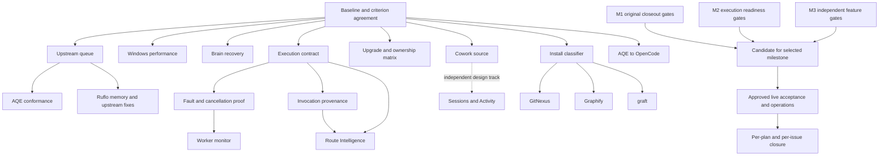

# Completion Program Implementation Plan

> **For agentic workers:** Use superpowers:subagent-driven-development after maintainer confirmation.
> This program orders independently reviewable work packages. Each package starts with a bounded,
> code-level plan against its actual base; research and contract gates precede implementation.

## Status

**Active — M1 only:** isolated remediation fixes, guarded tests and local unit commits authorized
2026-09-30. M2/M3 execution and unresolved decisions remain separate.
Planning baseline: `main@0511d575d3db093139f15ec70c9b9657f297ce7e`, 2026-09-29.
PR #285 is merged; main CI and container checks passed. The completed develop branch was removed.
Authority excludes pushes, publication, installations, real-data operations, spending and cleanup.
It changes no existing plan's authority or recorded approval.
Updated 2026-09-30: milestone corrections and D-22–D-25/D-27–D-29 are confirmed.
Session organization option B and Unknown Activity <10% are approved design requirements.
M1 source work now proceeds under the recorded scope; M3 research/processing stays deferred.
Focus reset 2026-09-30: P11S research is parked with its approved decisions; resume M1 closeout.
M3 companion/classifier decisions are not prerequisites to authorizing a bounded M1 batch.

**Goal:** Satisfy the remaining acceptance criteria of eight plan documents and all 13 currently
open repository issues, adopt verified upstream fixes, answer upstream requests, and archive
finished plans without disguising unfinished work as completion.

**Architecture:** One controller owns scope, shared contracts, manifests, integration and closure.
Ruflo supplies coordination and provenance; native coding workers implement. Actual AQE tools
supply scoped requirements, integration, resilience and quality evidence when they work. No
coordination receipt or predicted score substitutes for an executed test or runtime observation.

**Tech stack:** Node.js ES modules, node:test, guarded test runner, GitHub Actions, existing host
adapters, upstream-owned Ruflo/AQE/Brain runtimes and optional companion adapters.

**Spec:** Existing plan criteria, live issue bodies, ADRs and the accompanying
[acceptance ledger](2026-09-29-plan-completion-acceptance-ledger.md). The eight source plan names and
archival conditions are enumerated below. Two September 29 plans are currently untracked local
drafts; snapshot and reconcile them before adopting their proposed implementation details.
The [broader conversation/Topic rubric](../proposals/v5/2026-09-30-conversation-activity-and-topic-taxonomy-design.md)
has approved P11S direction; exact definitions await review, and consumer-chat ingestion is unverified.

## 1. Milestones and boundaries

- **M1 — older remediation plans closed:** Windows acceptance, AQE acceptance, watcher proof,
  release/install acceptance and approved real-data operations completed; all original rows have
  evidence or an already-approved disposition. Archive the older records in the agreed order.
- **M2 — execution readiness closed:** execution evidence, cancellation, monitor, upgraded-install
  proof, provider provenance and required source coverage pass; close #239 against its own checklist.
- **M3 — remaining feature backlog closed:** companion integrations, AQE-to-OpenCode routing and
  Route Intelligence, independent Cowork/session organization, and deferred ADR-0048 evaluation
  meet their own complete criteria. These do not become artificial blockers
  for M1 merely because this master program also tracks them.
- A tested mitigation may satisfy only a criterion that permits it. Strict upstream-release
  criteria in #213/#95 stay blocked until that release exists and passes our tests.
- An unresolved item retains its issue, owner, exact blocker, next probe and review trigger.
  Naming an issue is not evidence that a gated operation occurred. No silent scope waivers.

## 2. Decisions before dependent execution

| Decision | Recommendation | Blocks |
| --- | --- | --- |
| Windows rule — approved 2026-09-29 | Preserve #262's ten-run median plus v2's three consecutive PR runs with every Windows leg under 300 seconds; record samples without filtering failures. The stronger ten-all-green proposal is rejected for this program. | P02 closure |
| Upstream contributions — approved 2026-09-29 | Prepare reproductions and fixes in isolated upstream forks; ask approval of exact diff/text before publishing. Preparation is approved in scope; each external publication retains its exact-text/diff approval gate. | External part of P05/P16 and native fixes |
| D-22 cancellation — confirmed 2026-09-30 | Separate requested/stopping/stopped/refused and generation-fenced results; confirm stopped only with executor evidence. Scope forced termination to owned processes. | P06–P08 execution |
| D-23 A — confirmed 2026-09-30 | Scripted fake executors, injected time, sanitized recordings, disposable real-process tests, then separately approved real-executor proof. No paid work by default. | P07–P08 execution |
| D-24 recovery — confirmed 2026-09-30 | Bounded half-open recheck after configured TTL, explicit retry, truthful missing-KB state; preserve snapshots and private stores. | P04 execution |
| D-25 A — confirmed 2026-09-30 | Preserve four #240 obligations; amend obsolete command/version wording explicitly. Use the current command directly; no retired-command aliases or redirects and no invented universal AQE floor. | P03 closure |
| D-27 B — confirmed 2026-09-30 | Inspect existing CI, add missing bounded disposable Windows AQE conformance, then decide periodic coverage. Installation and CI dispatch remain separately gated. | Cross-platform claim in P03/P19 |
| D-28 A — confirmed 2026-09-30 | Separate configured from invocation-observed identity and evidence sources; unknown means vendor diversity unverified. No attestation claim. | P10 execution |
| D-29 A — confirmed 2026-09-30 | Bounded metadata discovery, optional reader only with reliable workspace association; otherwise keep #257 blocked with disclosure. Private bodies remain gated. | P11 execution |
| Session organization B — confirmed 2026-09-30 | Unified Sessions, independent filters, native/user titles and opt-in bounded context; host-specific evidence. See the [design/research](../proposals/v5/2026-09-30-session-organization-and-activity-design.md). | Independent M3 track |
| Activity gates — confirmed 2026-09-30 | Unknown Activity strictly <10%; automatic accepted-label correctness at least 95% with independent statistical evidence (accuracy A). Revised shortlist approved: compact ONNX lead, Laya challenger, genuine LLM reference and RuVector semantic candidate. Benchmark A and local bounded-user-request policy A approved; exact sampling/processing and production selection remain pending. No forced labels or denominator gaming. | Activity release acceptance |
| Companion relationship | Three independent opt-ins with coexistence disclosure; confirm whether GitNexus and graft are alternatives. Refresh licenses and supported commands before deciding. | P13–P15 |
| Route Intelligence | Approve per-activity quality tolerance, evidence thresholds, feedback source, freshness, retention and replay budget in its own spec/ADR before recommendations. | P17 |
| Operations | Approve exact release artifact, installation target, store-merge preview, deletion paths and any metered evaluation at their final gates. | P19 and paid/live proof |

Recorded D-20/D-21/D-30/D-31 answers in the local drafts must be preserved and reconciled, not
asked again. D-26's proposed reopening of #254 is obsolete: #254 closed under its approved
unreproducible alternative; new diagnostics need a separate demonstrated requirement. #256 closed
with #285. Do not reopen either to manufacture work. Do not infer consent from unanswered options.

## 3. Source and ADR reconciliation

Read complete amendments, not only the first status line. Existing numbered ADRs never move.

| ADR | Inspected status/date | Treatment in this program |
| --- | --- | --- |
| 0009 / 0014 | Implemented; updated 2026-09-29 / 2026-09-28 | Preserve Usage privacy/classification and CI coverage; session design changes need explicit reconciliation. |
| 0016 / 0017 | Accepted; updated 2026-09-27 | Preserve ownership, opt-in hosts and external configuration in companion/OpenCode work. |
| 0018 | Implemented; updated 2026-09-09 | Base execution exists. P06–P08 extend its contract, not rebuild it. |
| 0019 | Accepted; updated 2026-07-30 | Preserve bounded escalation and deadlines while extending cancellation. |
| 0021 | Accepted; updated 2026-09-09 | P10/P17 preserve host/provider separation; observation is not attestation. |
| 0023 | Implemented; amendments through 2026-09-28 | Preserve fail-closed errors and manual versus sync repair ownership. |
| 0029 / 0033 / 0034 | Accepted experimental / Implemented / Implemented; updated 2026-09-27 / 2026-09-26 / dated 2026-08-26 | External-host observation is capability-specific; preserve schema-native handoffs and the court evidence ladder. |
| 0031 | Accepted, governance implementation active; updated 2026-09-09 | Capability graduation needs actual evidence; registration is insufficient. |
| 0041 | Accepted, delivered assurance/watch subset; updated 2026-09-28 | P01/P03/P05 adopt fixes under dependency removal proofs and the support window. |
| 0048 | Accepted; delivered implementation, human evaluation outstanding; updated 2026-09-29 | Deferred M3 evaluation owns its human/platform gates; no automatic Implemented stamp or new M1 blocker. |
| 0054 | Implemented; updated 2026-09-20 | Preserve export privacy and evidence identity if P06/P17 expose new records. |
| 0055 | Implemented; amendments through 2026-09-29 | Later N-1 amendment supersedes the old universal-floor removal condition. Preserve ordinary busy behavior. |
| 0058 | Accepted, implementation in progress; amendments through 2026-09-28 | Retain native/governance limits until source-bound runtime proof exists. |
| 0060 | Accepted; updated 2026-09-29 | Surface classification delivered. P11 is the Cowork source; P11S extends session organization/Activity; P10 is invocation provenance. |
| 0061 | Accepted; dated 2026-09-27 | P04 revisits the documented uninstall/fresh-install recovery contract against current Brain and held state. |
| 0062 | Accepted; updated 2026-09-29 | Preserve live holders, starter-pattern policy and feature-specific version floor; Windows remains unverified. |
| 0063 | Accepted; updated 2026-09-29 | Preserve explicit POST refresh, read-only GET and separate evidence freshness/attempt times. |

Concrete reconciliation target: ADR-0061 Decision 5 describes uninstall followed by sync taking
fresh install and clearing the hold, while `activeHeldRefresh()` in `src/lib/ruvnet-brain.mjs`
uses only the unchanged version pair, with no TTL or missing-KB invalidation. The P04 regression
must establish the full sync path before changing the ADR or claiming this recovery works.
No registered Ruflo ADR review/verify tool was found; use direct ADR/source/test comparison.
For every accepted-contract change, update Status as warranted, Updated date and a one-line
change note in the same PR. Preserve reserved ADR-0056/0057 on the existing v5 branches.

## 4. Ownership, sequencing and integration

Use short-lived branches from current main; do not recreate develop by default. Open unit-commit
feature PRs into main after independent review and all required CI. Main merge remains human-owned
unless the maintainer explicitly changes that rule. Preserve unrelated PR #281 and existing work.
Controller plus at most three workers; one writer per worktree. Only the controller changes shared
registries, package/lockfiles, ADR indexes or global status/command wiring. Workers hand off patches
for those paths. Integrate serially and rebase dependent work after its prerequisite merges.
Prefer controller, two writers and one reviewer/research slot; exact file claims precede dispatch.
Label dependencies as contract prerequisites, file serialization, or scheduling preferences.



P16 research starts after P00 and its integration waits on its own upstream contract, not P05. P17 historical
projection/specification can start before P06; prospective learned recommendations wait for P06,
P07 and P10. P13–P15 can research in parallel; shared lifecycle/configuration integration is serial.
P18/P19 select one milestone, never require all three: M1 uses its original closeout gates and
approved dispositions; #213's strict upstream closure remains independently open if unproved.
M2 uses P06–P10 plus relevant P03/P05 runtime proof. P09 establishes executable ownership without
requiring P12's broader classifier. M3 contains P11/P11S and P12–P17; ADR-0048 evaluation has a
named deferred track. Cowork disclosure is required where relevant; its implementation is not a
blanket #239 prerequisite. Each original plan still closes against its own accepted conditions.

## 5. Common work-package contract

Every numbered package records base SHA, package/artifact digests, owned paths, inputs, outputs,
acceptance evidence and rollback. Size is relative, not an elapsed-time estimate.
For code: reproduce with a durable failing test, make the smallest implementation, run its focused
checks, update affected ADR/docs, commit one logical unit, independent review, then exact-head CI.
For research/operations: write the hypothesis and stop condition first; retain failures and refusal
receipts. Stop dependent writes on a failed prerequisite; do not merely retry until green.

```bash
node scripts/run-tests.mjs focus tests/kit/execution-schema.test.mjs tests/kit/execution-runner.test.mjs
node scripts/run-tests.mjs unit
node scripts/run-tests.mjs ui
node scripts/run-tests.mjs focus tests/quality/comment-label-guard.test.mjs
```

Use each package's named suites for its focused cycle. Before each complete feature PR run types,
ESLint, complexity, Markdown, build, internal links and required cross-platform CI. The full OS/Node
matrix and coverage floors remain. Do not run pnpm in a symlinked-node_modules worktree. No broad
optional test repetition after sufficient evidence. AQE recommendations require real executed
outputs; unusable tool output is disclosed, not renamed as a successful AQE run.

## 6. Ordered work packages

### P00 — Establish the single closure ledger (S; high confidence)

**Owns:** eight source plans, this plan/ledger, issue acceptance mapping and ADR/index handoffs.
**Steps:**

- [ ] Snapshot current main, open issues/comments, draft-plan hashes, PRs and ADR status/date stamps.
- [ ] Resolve the decision table; adopt/reconcile the two untracked drafts without overwriting concurrent edits.
- [ ] Assign every acceptance-ledger row a package, evidence location and closure predicate; classify inherited proof separately.
- [ ] Refresh stale main/develop/closed-issue references and record #285 plus branch cleanup; keep operational gates open.

**Done:** all 13 issues and eight plans accounted for; no implicit criterion change. Rollback: revert only owned documentation edits.

### P01 — Triage upstream attention and release candidates (M; medium confidence)

**Owns:** `src/lib/hook-audit/agentic-dependency-constraints.json`, `docs/upstream-watch.md`, registry tests.

- [ ] Refresh `node scripts/upstream-watch.mjs report --json`; inspect AQE #528/#532/#535, distinguish requests from acknowledgements, and carry successor #786/#787 limitations.
- [ ] Build one adoption row per released candidate: #735/#528/#532/#535/#754/#755/#757/#758/#759/#778; record first fixed version, fix commit and package proof.
- [ ] Confirm #756 manually; retain #655/#753 constraints until full conformance passes. Do not treat the report's actionable label as a retirement authorization.
- [ ] Keep Ruflo #3194/#3444/#3445/#3473 mitigations while the supported-version floor predates their fixes; record each waiting thread's owner and retest trigger.
- [ ] Reuse successful scheduled check 36729784908 (2026-09-30); separately verify ledger/notification effects and disposable failure paths. A real routine trigger needs approval; record dispatch only when proved.

**Done:** every report item has an action/hold/retest disposition, actual replies are ready for exact-text approval, and watcher effects have evidence. Test `upstream-watch-*` suites; preserve failures. Rollback: retain registry histories and revert only the failed adoption.

### P02 — Close Windows performance #262 (M; medium confidence)

**Owns:** measured slow test files, their fixtures and explicitly reviewed CI changes; no suite reduction.

- [ ] Extract step/file timings from runs 36627279218 and 36625700956; Node 24 took 310/311 seconds. Re-identify today's critical path instead of assuming AQE schema creation still dominates.
- [ ] Select one measured bottleneck; preserve assertions, Windows EBUSY coverage, tripwire, full matrix and 30-minute timeout in its failing-before/passing-after experiment.
- [ ] Run candidate CI once per meaningful change; retain failures and cancellations and separate queue delay from job duration.
- [ ] Publish the ten-run cohort/median and agreed consecutive-run proof; close only when both agreed requirements hold. Do not manufacture a streak with no-op PRs.

**Done:** agreed criterion and all #262 preservation checks pass. Update both Windows plans, then archive together. Rollback: revert performance-only changes if correctness or measured timing regresses.

### P03 — Adopt released AQE fixes and settle #240 (M; medium confidence)

**Owns:** AQE readiness/pin/store/embedding boundaries, `tests/live/aqe-*`, ADR-0055/0062 and registry handoffs.

- [ ] Acquire the published 3.14.6 artifact in a disposable prefix; verify integrity. Tag ancestry contains #782/#783/#784/#788; test distribution contents and behavior separately.
- [ ] Run repeated-init byte/mtime convergence, full/compact/none guidance preservation, CLI exit, subfolder root/store, MCP startup and optional pattern-index conformance.
- [ ] Exercise a real disposable MCP holder plus the supported packaged-kit verification path on macOS/Linux/Windows; verify no create fall-through or destructive recovery and independent I/O errors still fail.
- [ ] Test concurrent append, import and old-fork repair separately with backup/rollback and tamper refusal; never infer safe real-store merge from a fresh-chain test.
- [ ] Reconcile #240's obsolete command/version wording explicitly; close only with all literal or maintainer-amended criteria proved. Retire each workaround in its own reviewed unit only when the supported-version policy permits it.

**Done:** source/package/platform-bound receipts and registry/ADR/docs agree. Focus `aqe-verification`, `aqe-live-lock-process`, `aqe-store-*`, `aqe-codex-guidance-conformance`; discover exact opt-in flags before live probes. Rollback: restore prior supported projection; never overwrite live stores.

### P04 — Repair Brain held-refresh recovery #271 (M; medium confidence)

**Owns:** `src/lib/ruvnet-brain.mjs`, Brain status section, relevant heal/sync paths, ADR-0061.

- [ ] Reproduce unchanged-version hold after its cause clears and after KB removal using disposable fixtures; verify current 4.3.36 behavior before claiming an upstream fix.
- [ ] Add TTL/malformed-clock/missing-KB/fresh-active-hold regression cases plus an explicit bounded retry path.
- [ ] Implement approved half-open checks; preserve private snapshots, bound installer retries, and distinguish missing KB from installed plugin state.
- [ ] Reconcile ADR-0061 recovery text with the demonstrated sync path; run `brain-held-refresh`, `brain-held-refresh-sync`, `ruvnet-brain` tests and CLI help/dispatch checks.

**Done:** hold can recover without manual JSON edits, no repeated unsafe installer loop, no automatic deletion. Brain #335/#331 remain separately tracked until verified fixed. Rollback: revert retry behavior, retain recorded refusal and all data.

### P05 — Prove memory routing and complete #213 (L; upstream-dependent)

**Owns:** `ruflo-memory*`, `memory-route-probe.mjs`, project-memory projections, live memory-routing tests.

- [ ] Locate the checkpoint written by MCP; inspect exact key/namespace, independent persisted rows, active process routes and DB/WAL paths. Unchanged main-file mtime alone does not establish lost data or broken hooks.
- [ ] Build isolated CLI→MCP/MCP→CLI, restart, two-path-in-one-process, env/flag/root, native-disabled and encrypted-path reproductions. Never print corpus values.
- [ ] If still broken, prepare upstream fixes for #3196/#3446, verify #3143 path identity and #3450 purge coverage; request exact publication approval. Evaluate #3508 as an upstream read-only route API, not a reason to invent a private competing memory stack.
- [ ] After a fixed published package exists, test disjoint keys/conflicts/TTL/deleted rows/embeddings, backup and rollback; version-gate adoption and preserve both corpora until migration is approved.

**Done:** every #213 criterion passes and kit integration merges. Local route diagnostics alone cannot close it. Rollback: preserve original files and restore prior launch configuration; no implicit corpus consolidation.

### P05b — Other upstream defects, isolated contribution lane (L; upstream-dependent)

**Owns:** isolated upstream checkouts and approved contribution drafts; no shared kit source writer.

- [ ] Reproduce Ruflo #2885 on the affected native macOS runtime; bind trace, package graph and source, then prepare the smallest tested upstream fix. Native-learning health remains unproved until a released candidate passes.
- [ ] Recheck #3509's retired Codex MCP command and #3449's daemon configuration behavior; preserve current kit mitigations and prepare upstream changes only for still-reproduced gaps.
- [ ] Reproduce the four locally documented Ruflo task-ledger concerns independently: invalid state transitions, cancel-after-complete, empty-result completion and synthetic worker success. Do not present source readings as runtime reproductions or file duplicate issues.
- [ ] For each contribution, preserve failure/green tests, upstream branch and exact diff/text for approval; follow through review, merged commit, published release and kit-side adoption proof. Do not patch global installed dist files.

**Done:** each relevant defect is either fixed/released/verified or visibly blocked with owner and trigger. This lane is not a substitute execution engine. It can run beside P05 when ownership and the four-agent limit permit; no healthy-native or trustworthy-ledger claim follows from a draft PR.

### P06 — Execution evidence contract, first vertical slice (L; medium confidence)

**Owns:** execution schema/runner/handoff contract, `src/commands/run.mjs`, a bounded private execution-record store and its new tests.

- [ ] Prove what each host adapter emits and whether AQE task state can be observed across processes; prohibit a monitor architecture that assumes access to another MCP process's in-memory map.
- [ ] Accept an ADR defining task/attempt/executor/generation identity, accepted/started/progress/terminal/result-valid/persisted facts, status compatibility, retention and redaction. Allocate a free ADR number without using reserved 0056/0057.
- [ ] Implement one packaged-CLI fake-worker run that persists a validated terminal receipt and is readable after exit/restart; inject persistence failure and prevent a success claim.
- [ ] Version changed schemas and document migration/older-record behavior; preserve existing host admission, handoff bounds, absolute deadline and disabled-host intent.

**Done:** one end-to-end vertical slice establishes durable truthful execution. Focus `execution-schema`, `execution-runner`, `execution-handoff`, new persistence suites; update ADR-0018/0019/0023. Rollback: disable new ingestion while preserving versioned records.

### P07 — Cancellation and complete fault matrix (L; medium confidence; depends P06)

**Owns:** execution runner/process-tree/subprocess/host adapters and dedicated fake executors.

- [ ] Add accepted-never-started, alive-without-progress, slow-valid, missing handler, failed child, empty result, persistence failure, deadline, cancellation refused, late completion, live lock and real I/O modes.
- [ ] Separate cancellation request from confirmed stop; fence old generations and capture late completions without replacing the authoritative terminal result.
- [ ] Test hung prepare/launch/observe/cleanup boundaries, parent disconnect, descendants and retry idempotency; cap retries to operations proved repeatable.
- [ ] Exercise the packaged CLI and parent notification on all supported platforms, then one approved real executor path. AQE #707 stays an upstream limitation wherever stop cannot be proved.

**Done:** all 12 named outcomes and cleanup boundaries have observable assertions and retained receipts. Focus execution/process-tree suites; fixture tests do not become provider proof. Rollback: fail closed and preserve unresolved-process evidence.

### P08 — Worker early-warning monitor #255 (L; medium confidence; depends P06/P07)

**Owns:** new execution monitor/alert store, CLI presentation and controller-owned dashboard/statusline handoffs.

- [ ] Accept signal/threshold/notification design: startup, queue, execution and useful-progress deadlines; heartbeat alone cannot establish progress; unknown token/cost rate remains unknown.
- [ ] Test stalled versus slow-valid workers with injected clocks, recorded fixtures and the P07 fault modes; prove no false success or silent parent failure.
- [ ] Implement durable redacted alerts and truthful exit codes, CLI notification and visible dashboard states; test delivery across restart and bounded retention.
- [ ] Verify rendered, keyboard and small-screen behavior plus actual parent-visible real-executor notification under explicit authority.

**Done:** all #255 criteria and #239 monitoring rows pass; accepted ADR and source-bound evidence linked. Rollback: turn off monitoring separately from execution; preserve alert records.

### P09 — Upgrade, ownership and convergence matrix (L; medium confidence; starts after P00)

**Owns:** lifecycle/setup/sync/status/installation contracts; shared integration owner serializes overlaps with P03/P04/P12–P15.

- [ ] Re-audit already-delivered #239 ownership, explicit scope/exclusion, diagnostic causes, host-state and observability rows; reuse exact proof, reproduce remaining gaps before edits.
- [ ] Build clean and upgraded fixtures with custom MCP, foreign binaries, disabled-installed hosts, existing stores, unknown TOML/configuration, concurrent owners and stopped services.
- [ ] Add missing ownership/capability inventory and stopped-service checks without silently starting services or making hosts routable; preserve no-clobber behavior.
- [ ] Run packaged setup/sync/verification twice and prove convergence, backend ownership and real-state isolation on Linux/macOS/Windows.

**Done:** all clean/upgrade rows pass; preserved foreign configuration is a truthful manual disposition, not a failed automatic repair. Focus adapter lifecycle/setup/sync/hosts suites. Rollback: restore owned changes using receipts; retain foreign state.

### P10 — Per-invocation provider provenance (M; medium confidence; depends P06)

**Owns:** Claude/Codex/OpenCode execution result normalization, receipt/API schema and provenance tests.

- [ ] Inventory actual host fields and precedence; keep configured provider, observed provider/model and evidence source/freshness distinct.
- [ ] Test missing/conflicting metadata, proxies/custom endpoints, delegated workers and malformed results; never infer a vendor from host/model names.
- [ ] Populate only proved fields and expose unknown honestly; preserve credentials in their owners' stores and redact public projections.

**Done:** #239 invocation-level provenance passes; ADR-0021/0060 and prospective #109 inputs agree. This does not redo V6's existing session classifier. Rollback: emit unknown for unsupported fields without changing usage totals.

### P11 — Cowork discovery #257 (M/L; high uncertainty)

**Owns:** optional footprint/project source and discovery fixtures; ADR-0060.

- [ ] Obtain approval for bounded key-name/count inspection and inventory each platform without reading prompt text.
- [ ] Prove a stable project-folder association; if absent, record the exact missing contract and seek a product decision rather than guessing.
- [ ] Implement an opt-in source with schema drift, unreadable/rotated/capped stores, duplicate imported copies and skipped-reason coverage tests.
- [ ] Verify Projects/Usage disclosure remains honest on unsupported platforms; close only when the issue's supported scope is delivered or explicitly amended.

**Done:** discovery and coverage criteria pass with metadata-only evidence. Focus project-source/session-surface suites and rendered coverage. Rollback: disable this optional source; preserve every user file.
The independent P11S Sessions/title/Activity extension follows the September 30 design and ledger.
It requires host-specific contracts, its own benchmark, content permission and quality gates;
metadata-only P11 proof cannot establish title/classifier accuracy or whole-account coverage.

### P12 — Shared install-method classifier #116 (M; medium confidence)

**Owns:** new `src/lib/install-method.mjs`, tests, host-status handoffs and public API documentation.

- [ ] Confirm current mise JSON and npm/pnpm path contracts using fixtures; preserve npm-global under mise-managed Node as npm-global.
- [ ] Implement read-only `classifyInstall(binName, { npmPkg })` returning method/backend/backendRef/path/version/versionNamespace/updatable as specified in #116.
- [ ] Cover npm, a release-shaped backend, plugin-shaped backend, absent mise, unknown backend, path-boundary collisions and query failure; derive backend identity from mise output, never a hardcoded backend catalogue.
- [ ] Update status labels with no change in host update ownership. Only npm-family classifications become updatable; Python lifecycle policy is separate.

**Done:** every #116 criterion passes. Proposed test: `tests/kit/install-method.test.mjs`; add existing host-status regressions. #115 can ship a narrow classifier independently, but this program schedules the shared implementation first to avoid duplicate work.

### P13 — GitNexus companion #115 (L; medium confidence; depends P12 by scheduling choice)

**Owns:** new GitNexus lifecycle/adapter/test modules; controller integrates companion registry/config/status.

- [ ] Refresh upstream commands, license, native bindings and release source; accept its companion/coexistence ADR and disabled/unowned migration.
- [ ] Implement detection/ownership and explicit installation using the owning backend; external and Docker-only installs remain unowned.
- [ ] Add enabled-host MCP wiring with file injection OFF, explicit index actions, independent verification and idempotent non-mutating dry-run/sync behavior.
- [ ] Implement receipt-based uninstall, separate confirmed package removal/purge, partial-teardown nonzero exit, preserved index and guidance, and content-free telemetry.

**Done:** all 18 #115 criteria, lifecycle/mise/native/platform/no-clobber matrices pass. Follow existing companion registry and `adapter-lifecycle-conformance` patterns. Rollback: remove only receipted wiring; preserve package/data until explicitly authorized.

### P14 — Graphify companion #117 (L; medium confidence; depends P12)

**Owns:** new Graphify/Python-install adapter modules; shared block mediation is controller-owned.

- [ ] Refresh license, Python distribution and cost-bearing operations; accept GitNexus relationship and guidance-block mediation before wiring.
- [ ] Implement pip/pipx/uv-tool detection, reusing P12's mise backend facts without broadening its npm-only update permission.
- [ ] Default always-on blocks OFF; test nested/colliding/missing/foreign markers, enabled-host scoping and preserved custom guidance.
- [ ] Add idempotent lifecycle with no implicit paid indexing, explicit costly actions, preserved graphify-out data, and redacted status/receipts.

**Done:** all 10 #117 criteria and Python/block-mediation/cost/privacy tests pass. Rollback: restore owned block contributions and preserve data; no broad file replacement.

### P15 — graft companion #167 (L; medium confidence; depends P12)

**Owns:** new graft lifecycle/adapter/tests; controller owns setup/sync/uninstall/registry integration.

- [ ] Refresh CLI/native/license behavior and decide GitNexus overlap; reconcile the issue's install-versus-sync npm ownership wording before coding.
- [ ] Separate machine installation from project init; scope project agents and default Codex global writes OFF (`--no-global`).
- [ ] Keep deep/LLM builds explicitly gated; prove structural builds' actual network/cost behavior, native install on three OSes, stamp-based repair and update-nudge consistency.
- [ ] Implement independent graph freshness/wiring facts, idempotent dry-run/sync, preserved notes/graph data and separately approved exact-path purge.

**Done:** all 15 #167 criteria and dual-writer/no-clobber/native matrices pass. Reuse upstream graph/stamp operations, not a kit-owned graph implementation. Rollback: remove only owned wiring; preserve source and notes.

### P16 — AQE → OpenCode #95 (L; upstream-dependent)

**Owns:** upstream AQE provider/transport prototype, then version-gated kit projection and OpenCode execution tests.

- [ ] Recheck current AQE/OpenCode releases and the reverse-direction integrations; accept provider-versus-plugin architecture and independent host/provider/model/cost/billing semantics.
- [ ] Prototype against OpenCode's native session API in an isolated upstream checkout: loopback, ephemeral auth, explicit provider/model, permissions never auto-approved, tools off unless explicitly designed otherwise.
- [ ] Prove one named AQE agent route, timeout/abort/owned-process cleanup, dynamic provenance and bounded fallback; prepare exact upstream issue/PR for approval.
- [ ] After a published upstream contract passes verification, project opt-in AQE routes without copying secrets or clobbering foreign entries; preserve older-version limitations.

**Done:** all 29 #95 criteria including real upstream release, supported-platform CI, approved live route and teardown proof. No private AQE router or OpenAI-proxy substitute. Independent of #109 historical analysis; do not make it a false prerequisite there.

### P17 — Route Intelligence #109 (XL; high uncertainty; dependent stages)

**Owns:** new `src/lib/model-intelligence/` context, usage/read-model consumers and controller-owned execution/dashboard contracts.

- [ ] **A: Contract.** Accept DDD/ADR for OperationEpisode, OutcomeEvidence, EvidenceGrade, HarnessFingerprint and RouteRecommendation; decide tolerance, freshness, retention, feedback and replay authority.
- [ ] **B: Historical projection.** Build bounded deterministic Claude/Codex/OpenCode episodes with provenance, unknowns, cache migration and replay/double-count guards; no self-reported success labels or unsupported account joins.
- [ ] **C: Prospective evidence.** Consume P06/P07/P10 receipts with attempts, repair/escalation and independently evidenced outcomes; preserve source-to-recommendation lineage.
- [ ] **D: Evaluation.** Compare compatible activity/complexity/harness cohorts; separate API-equivalent cost, observed cash and subscription capacity; withhold recommendations for confounding or insufficient evidence.
- [ ] **E: Real routing backend.** Integrate Ruflo's actual MetaHarness-backed prediction/feedback API after version/health/contract proof. Missing backend produces unavailable evidence, never a replacement kit heuristic.
- [ ] **F: Findings UI.** Put evidence grades/counts/uncertainty/freshness and explicit copyable route commands in Usage → Findings; read-only/offline normal viewing; keyboard/responsive checks; no raw text or embeddings.
- [ ] **G: Paired proof.** With separate budget/fixture approval, run matched or paired evaluation and bounded prospective cascades; prove quality tolerance, net retry/repair cost, privacy and retention/rebuild/deletion behavior.

**Done:** all 35 #109 criteria including actual AQE gates, paired-evaluation evidence and release seal. No invented 98/100 score or learned-quality claim. Rollback: disable recommendations, retain versioned evidence, never auto-change routing policy.

### P18 — Freeze a milestone release candidate (M; medium confidence)

**Owns:** exact artifact, integration evidence, release notes and acceptance audit; no publication yet.

- [ ] Select M1/M2/M3's exact included packages and remaining permitted limitations; reconcile every checklist row against its actual criterion.
- [ ] Integrate reviewed PRs serially; rebuild the artifact and run full guarded tests, quality, UI, package contents/load checks and supported-platform CI on the exact source.
- [ ] Run clean/upgrade/fault matrices on the packed artifact and compare upstream incorporation before considering any historical local patch.
- [ ] Produce artifact hashes, version/dependency bindings, rollback instructions and concrete release/install requests for the maintainer.

**Done:** independently reviewed candidate and complete receipt, not merely green source tests. Any source/package change invalidates affected receipts and requires scoped revalidation.

### P19 — Approved release, real-machine acceptance and data operations (L; approval-dependent)

**Owns:** explicit user-approved installation/state targets; no unrelated machine cleanup.

- [ ] After exact-artifact approval, publish/install through the release gate, restart owned affected processes and verify actual host/provider/memory/embedding/task paths and rendered dashboard.
- [ ] Run sync twice and verify ownership/no-clobber and fresh footprint schema for the selected milestone. ADR-0048 human evaluation stays in its named deferred track; retain Accepted status until its own gates pass.
- [ ] For real AQE strays: resolve paths/holders; honor the recorded starter-pattern policy; present current preview; backup; rehearse on copies; obtain final apply approval; verify imported counts/integrity/audit chain and archival receipt.
- [ ] Refresh temp/snapshot inventories and preservation hashes; obtain literal-path deletion approval. Worktree evidence must be exported/verified before any separately approved removal.
- [ ] Diagnose project-memory persistence through exact read-back and reopened-process evidence; personal Codex memory changes require a direct user request. Record attended time as unmeasured historically; never manufacture it.

**Done:** each approved operation has before/after evidence and rollback/preservation proof. An unapproved operation remains pending, not silently waived.

### P20 — Close issues and archive plans incrementally (S per file; high confidence)

**Owns:** closure comments, current plan statuses, archive moves/index and final acceptance ledger.

- [ ] Recheck remote issue state and every criterion; post source/runtime evidence and limitations. Close only after its own completion gate, not just an upstream issue closing.
- [ ] Update each plan's final Status, add the decision-log closeout and cite the corresponding merged changes and operation receipts.
- [ ] Dry-run `node scripts/docs-relocate.mjs --map <reviewed-map.tsv> --mentions --dry-run`, inspect all rewrites, apply, and add one archive-index row per file. Preserve original dates and flat naming.
- [ ] Run guarded docs-layout/docs-relocate/doc-citations tests, Markdown and the full internal Markdown/HTML link check; independent review before the documentation PR.

**Done:** applicable milestone's plans are truthfully complete/archived; residual master-program issues remain visible. Never move ADRs or rewrite frozen evidence to look current.

## 7. All open issues: closure ownership

| Issue | Package(s) | Earliest milestone / blocking fact |
| --- | --- | --- |
| #271 Brain held refresh | P04 | M1; local recovery fix, upstream reclaim limitation separately disclosed |
| #262 Windows timing | P02 | M1; agreed measurements and preservation gates |
| #240 AQE live lock | P03 | M1; real holder/managed-version criteria, supported command mapping |
| #213 Ruflo memory | P05 | Upstream fixed release plus preservation/migration proof; no premature closure |
| #239 readiness | P03/P05–P10/P18/P19 | M2; its 25 rows have proof or accepted criterion-permitted mitigation; no blanket P11/P12 dependency |
| #255 worker monitor | P06–P08 | M2; contract and fault matrix precede monitor |
| #257 Cowork | P11; separate P11S extension | Independent M3 source; stable workspace association and approved metadata scope; Sessions/Activity has its own gates |
| #116 install classifier | P12 | M3; useful shared foundation, scheduled before companions |
| #115 GitNexus | P13 | M3; license/native/ownership and full lifecycle proof |
| #117 Graphify | P14 | M3; Python ownership, block mediation, cost boundaries |
| #167 graft | P15 | M3; project/global split, Codex coexistence, native builds |
| #95 AQE/OpenCode | P16 | M3; upstream transport release and live teardown proof |
| #109 Route Intelligence | P17 | M3; actual outcome evidence, real learning backend, paired quality proof |

## 8. Every existing plan: exact disposition

| Source under docs/plans | Required completion | Archive name |
| --- | --- | --- |
| `2026-09-28-ci-windows-test-speed.md` | P02: measured acceptance and #262 closure; all Task 4 entries reconciled | `2026-09-28-plan-ci-windows-test-speed.md` |
| `2026-09-28-ci-windows-test-speed-design.md` | Same P02 proof; update claimed outcome to measured result | `2026-09-28-design-ci-windows-test-speed.md` |
| `2026-09-26-remediation-program.md` | Reconcile 14 historical unchecked boxes to completed work or approved successors; retain Superseded status | `2026-09-26-plan-remediation-program.md` |
| `2026-09-26-issues-237-238-239-verification-and-decisions.md` | Append final V7/#285 and operational dispositions; qualify original baseline; archive with program closeout per D-31 | `2026-09-26-audit-issues-237-238-239-verification-and-decisions.md` |
| `2026-09-28-remediation-program-v2.md` | All eight DoD items reconciled under the approved execution overrides; no hidden release/store/temp/watch/retention gate | `2026-09-28-plan-remediation-program-v2.md` |
| `2026-09-28-remediation-v2-develop-execution.md` | Phase D done; Phase E release/install/store/cleanup evidence or explicitly approved disposition, retained evidence safe | `2026-09-28-plan-remediation-v2-develop-execution.md` |
| `2026-09-29-execution-evidence-and-upgrade-acceptance.md` (untracked) | P06–P09 and its six completion conditions, adopted/reconciled in P00 | `2026-09-29-plan-execution-evidence-and-upgrade-acceptance.md` |
| `2026-09-29-issue-239-closure-and-v5-foundation.md` (untracked) | P03–P11/P18–P20; #239 acceptance and all its issue/operation rows, with closed #254/#256 not replayed | `2026-09-29-plan-issue-239-closure-and-v5-foundation.md` |

D-31's recorded order is CI pair → v1 → decision log/v2 → execution evidence → closure plan.
Status updates happen immediately when facts change; archival waits for each row's gate. This
master plan and its ledger archive only after M3 or an explicitly approved final scope disposition.

## 9. First execution batch and stop rules

Recommended first vertical slice: **P06's packaged fake-worker terminal receipt**, because P07,
P08, P10 and P17 consume it. Before writing it, complete P00 and its contract decisions.
Start M1 with P02/P03 writing lanes; P06 contract design can proceed read-only in a review slot.
P01's read-only inventory can precede those; serialize registry/ADR handoffs. Schedule P04 after
one lane frees. P09 fixture design can proceed read-only, but lifecycle edits wait for overlapping
P03/P04/P12 ownership. P06 is M2's first slice; P05 upstream waiting does not block unrelated work.

Stop affected work for missing authority, unknown destructive targets, unproved data ownership,
contract dependency failure, or inability to establish a safe test environment. Upstream waiting
uses release/activity triggers and dated review notes; no idle loop or invented completion date.
No releases, posts, installs, memory migrations, deletion, metered provider runs or source fixes
were performed while drafting this program. Planning evidence is a snapshot, not conformance proof.
The live upstream report was valid: 10 released candidates, 3 reply flags, 1 unconfirmed release,
2 carried workarounds, 4 support-window holds, 44 waiting threads and 4 stale flags (groups overlap).
Scheduled check 36729784908 succeeded on 2026-09-30; dispatch/delivery remain separate proof.
AQE requirements_validate returned zero testable
requirements and no scenarios; it supplies no validation evidence for this plan. Direct source
criterion mapping and documentation checks are recorded separately.
