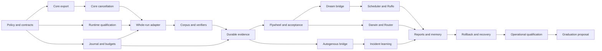

# Autonomous Experimentation Implementation Plan

> **For agentic workers:** Use `superpowers:subagent-driven-development` or `superpowers:executing-plans` to implement this plan task by task. Checkbox steps track work; no checkbox is completed by writing this document.

**Goal:** Deliver a removable laboratory that researches, evaluates, learns, and selects better experimental candidates autonomously while agentic-kit retains its execution and configuration responsibilities.

**Architecture:** Add a small, opt-in execution-result contract to agentic-kit. Implement the experiment controller in a separate `agentic-kit-lab` workspace using real MetaHarness, Dream Machine, Ruflo, Agentic QE, AgentDB, and Autogenous interfaces. Separate provisional search winners from durably accepted laboratory champions and from changes applied to the real project.

**Tech stack:** Existing JavaScript ESM/JSDoc in agentic-kit; TypeScript ESM and Node 24 in the companion; `node:sqlite` for the companion's transactional execution journal; MetaHarness Flywheel/Darwin/Router; Dream compiler/ledger; Rust Autogenous observer and generator. Qualify a Linux container execution environment for unattended native-host runs.

**Spec:** [Research and adoption recommendation](ruvnet-evolution-adoption.md), [ADR-0022](../adr/0022-metaharness-as-optional-assurance-companion.md), and the [contract specification](contracts.md) in this plan package.

**Status:** Proposed implementation plan, September 12, 2026. Creating these documents does not accept ADR-0022, install tools, authorize provider spend, enable schedules, or grant publication authority.

## Global constraints

- Preserve agentic-kit's zero-runtime-dependency package; no root package/lockfile change for companion dependencies.
- Preserve existing default `ak run` output and behavior. Add no top-level `ak improve` command.
- Keep `ak run` responsible for its internal dependency graph, host transports, per-attempt deadlines, escalation and cleanup.
- Do not recreate retired `codex mcp-server` projections; preserve supported Claude/Codex peer execution.
- Never allow two writers in one worktree. Read-only agents may share a checkout.
- Preserve `.agentic-qe/memory.db` and existing AgentDB data; experiment journal data is not a replacement project-memory store.
- No automatic changes to real `kit.json`, host projections, permissions, provider enablement, release gates or production source.
- Never interpret a score, signature, model agreement, process exit, or MCP registration as sufficient authorization.
- Keep every new source and documentation file under 500 lines. Split by responsibility rather than mechanically extending large existing test files.
- Existing core runtime floor remains `>=22.13.0 <23 || >=23.4.0`. Companion initially supports Node 24 only, with exact patch/image recorded by qualification.
- Use the real upstream engines. New code owns adapters, policy admission and persistence; it must not be presented as upstream Flywheel, Darwin, AgentDB or Autogenous functionality.
- Commit, push, merge, publish, schedule activation and worktree deletion require the applicable user authorization. Task completion alone grants none of these operations.

## Read the plan in this order

| Document | Purpose | Implementation tasks |
| --- | --- | --- |
| This document | Scope, architecture, sequencing, ownership and delivery gates | Cross-cutting |
| [Contracts](contracts.md) | Exact schemas, limits, APIs, journal transactions and isolation contract | Shared by all tasks |
| [Foundation](foundation.md) | Policy, core result export, cancellation, qualified runtime, evidence and evaluator | T01–T08 |
| [Learning and operations](learning-and-operations.md) | Flywheel, Dream, scheduling, Router, Autogenous, rollback, reporting and qualification | T09–T17 |
| [Graduation and GitHub Actions](graduation-and-actions.md) | Research-backed draft-PR graduation path and Task T18 | T18 |

The tasks deliver independently reviewable units. Each task specifies exact files, exported interfaces, representative test code, implementation rules and commands. The examples are proposed contracts, not claims that those modules already exist. Read the shared contracts before implementing any individual task.

## Repository and ownership layout

Use two separately versioned workspaces:

- `AK` means this agentic-kit repository. Paths beginning `src/`, `tests/kit/`, or `docs/` in the foundation plan are relative to `AK` when labeled accordingly.
- `LAB` means sibling `../agentic-kit-lab`, created only during implementation. Its package name is `@pacphi/agentic-kit-lab`, private initially, and its CLI is `ak-lab`.
- `STATE` means a separately configured absolute local directory owned by the laboratory controller. It contains the journal, immutable evidence, caches and retained experimental worktrees. It is not mounted writable into candidate containers.

| Owner | Responsibilities | Cannot own |
| --- | --- | --- |
| Agentic-kit | Public result export; host execution/cancellation | Experiment selection, lab keys, schedules |
| LAB controller | Admission, total-run bounds, resource reservations, event queue, source snapshots, publication policy | User configuration or production release authority |
| MetaHarness | Candidate search/evaluation orchestration and its own lineage format | Durable application to this project's defaults |
| Dream Machine | Actual prompt compiler, ledger semantics and freshness tools where available | Enforcement of filesystem/network/spend boundaries |
| Autogenous | Actual observer, detector proposals, admission and replay primitives | Real traffic intervention or promotion authority in this plan |
| Ruflo | Actual research-role coordination and its own retrieval-flywheel state | LAB's sole durable scheduler or cross-product signing identity |
| Agentic QE | Quality work through verified upstream routes | Changing the fixed acceptance gate |
| AgentDB | Searchable learning records and evidence references | The transactional run/lease/budget journal |

## Bounded contexts and invariants

**Execution export** translates private runtime data into a strict public DTO. It contains observations, not proof that a source snapshot or cleanup claim is independently verified.

**Experiment admission** pins the source, toolchain, policy, budget, corpus and verifier identities. Its approved grant is outside candidate write access. Every protected operation checks the current epoch; possession of an old job description is insufficient.

**Evaluation** obtains fresh baseline/candidate workspaces, executes whole pipelines, verifies resulting artifacts independently, and records paired outcomes. A model saying it succeeded is not a passing verifier result.

**Learning** uses development data to explore candidates. A separate acceptance service evaluates a fixed candidate against an unseen shard and the frozen regression anchor. It alone can produce the admission verdict used by the laboratory champion transaction.

**Operations** persists run transitions, queue claims, reservations and champion pointers. One coordinator owns a local state directory. Horizontal/distributed controller operation is out of scope; do not claim a local SQLite lease implements distributed consensus.

## Dependency and parallelism plan



With four available agent slots, use one integration owner and at most three bounded lanes. Initially those lanes are core export/cancellation, runtime isolation, and journal/admission. After their gates pass, source-independent research may run in parallel; integration changes remain serialized. A coordinator, a model worker and a model verifier each consume a slot: `maxLanes=3` is a ceiling, not permission for three pipelines each spawning three more agents.

Use Ruflo to register and coordinate research roles; launch actual work through verified native host paths. Every child receives a deadline and a subset of its parent's capabilities. Agentic-kit pipelines initially use `--max-concurrent 1` inside each candidate worktree. A single global slot allocator accounts for nested research, proposal and model-backed verification calls.

## Delivery gates and acceptance

| Gate | Tasks | Observable acceptance |
| --- | --- | --- |
| G0 — reviewable design | T01 | ADR amendment, complete contracts and a rendered proposed grant; status remains Proposed until accepted |
| G1 — safe execution evidence | T02–T08 | Legacy CLI unchanged; sanitized JSON; cancellation and runtime containment proven; immutable baseline/candidate records |
| G2 — autonomous manual cycle | T09–T10 | Real Flywheel and Dream artifacts; one complete cycle with honest terminal verdict; disk faults cannot install a champion |
| G3 — recurring experimentation | T11–T12 | Nightly/event triggers, no overlapping owner, shared budget, learned candidate selection and pause/recovery |
| G4 — incident-driven proposals | T13–T14 | Actual Rust detector proposals from authorized samples; independent replay; no real traffic blocking |
| G5 — unattended qualification | T15–T17 | Fourteen scheduled cycles or fourteen days, whichever is longer; no unauthorized mutation, unaccounted execution or lost terminal records |
| G6 — reviewable graduation | T18 | Synthetic draft PR, independent rerun, attestation, stale-baseline and duplicate-nonce refusal |

G5 is a proposed operational threshold, not an upstream benchmark. A legitimate `REJECT` or `INCONCLUSIVE` can pass a cycle's operational checks. Adoption requires useful evidence and bounded behavior, not a quota of “successful” improvements.

The first demonstration uses synthetic deterministic fixtures and no model credentials. The next uses real eligible Claude/Codex hosts after explicit grant activation. Do not enable the live schedule merely because the deterministic fixture is green.

## Execution and deployment decisions

The initial autonomous runner targets a dedicated Linux environment with an existing rootless container engine and enforceable cgroup/network controls. macOS and Windows remain supported for core export/cancellation verification and read-only report consumption. Unattended LAB execution on those platforms is not claimed until the same isolation suite passes on a supported backend.

The inspected MetaHarness RVM adapter generates partition/capability/WASM configuration; that is not evidence of a ready native Claude/Codex subprocess backend. RVM can be added behind the same runtime interface after qualification. The first implementation uses container infrastructure explicitly; it does not label a custom wrapper as RVM. [Inspected RVM adapter](https://github.com/ruvnet/metaharness/blob/d5833dc6512ac1adeeef91a331c29055cd8a4dbb/packages/host-rvm/README.md), [Docker rootless documentation](https://docs.docker.com/engine/security/rootless/).

Use a no-network verifier container and a separate candidate container with access only to admitted host/provider transports. A worktree, `shell:false`, prompt instruction or environment scrub alone is not isolation. No candidate receives the container-engine socket, controller journal, acceptance corpus, signing key, publisher token or real workstation home.

Default publication is local evidence only. Preauthorized draft-PR publication is a later, separate publisher identity over verified artifact IDs. No public gist default, no force-push, no merge and no package publication. The scheduler continues research when the review queue is full; it pauses additional publication.

## Tool versions and qualification

Use the [research snapshot](ruvnet-evolution-adoption.md) as the initial dependency candidate set: MetaHarness `0.4.16`, Flywheel `0.1.11`, Darwin `0.10.2`, Router `0.4.0`, and Dream CLI `0.1.1`. Record exact package integrity hashes and resolved transitive packages in `LAB/package-lock.json`. Add no dependency to `AK/package.json` for those packages.

Use Dream source `3edd426f6c9c4b1e80235f7447dc863e749345cc` when qualifying freshness support. Use Autogenous source `7bf327a9754ce798364dbee8b2825af42a421fd4`; the Rust bridge builds against that checkout, not the unrelated assumption that installing Radio-MoE installs the Rust workspace. A new version invalidates the relevant qualification receipt; upgrades cannot occur during an experiment.

Keep Node's SQLite usage behind one LAB storage module. The Node 24 documentation currently labels it release-candidate stability; qualify the selected patch, busy handling and crash recovery rather than exposing its API throughout the code. [Node 24 SQLite](https://nodejs.org/download/release/latest-v24.x/docs/api/sqlite.html).

## Validation commands and review policy

For each implementation task, write its failing boundary test, run the focused command, implement the smallest unit, then rerun that command. Test error behavior and state transitions; avoid implementation-mirroring assertions. Test artifacts generated by AQE still need execution against the exact candidate.

Core integration gate, from `AK`:

```bash
node --test tests/kit/companion-result.test.mjs tests/kit/run-companion.test.mjs tests/kit/run-cancellation.test.mjs
pnpm run typecheck
pnpm run lint
pnpm run lint:cc
pnpm run lint:md
pnpm run build
pnpm test
```

The three focused test files above are created by T02–T03. `pnpm test` enforces 70% line/branch/function floors; the project target is at least 80% lines and 100% security-critical coverage. Report measured results and gaps, not a static fit score. Browser tests are required only if a separately approved UI change lands.

Companion gate, from `LAB`, after T01 defines the scripts:

```bash
npm run typecheck
npm test
npm run test:integration
npm run build
npm run verify:artifact
```

Container and live-provider tests are separately selected: ordinary tests must never choose a paid backend merely because an API key exists in the parent environment. Results distinguish `not-run`, `blocked`, `failed` and `passed`.

Review source contracts at integration boundaries. Keep package manifests, lockfiles, shared schemas and grant policy under the integration owner's exclusive claim. Use one reviewable change per task; create commits only when authorized. No plan task requires publication to be considered implemented.

## Effort and scope control

The earlier 7–12 day estimate covered the core workflow. This detailed scope also includes runtime qualification, durable admission, scheduling, and incident-driven learning. Budget approximately 10–18 engineering days for G1–G3, 4–7 additional days for G4, then the G5 observation period. These are planning estimates and should be recalibrated after T04's actual host-authentication/isolation qualification.

Production Autogenous promotion, model-weight training, a new agentic-kit dashboard, distributed LAB coordinators, automatic source merges and cloud publishing are excluded. T18 adds a maintainer-reviewed proposal path; it does not alter those exclusions.

## Requirement traceability

| Recommended sequence | Concrete tasks |
| --- | --- |
| Amend ADR-0022 for autonomy | T01 |
| Version/sanitize `ak run` and bound total execution | T02–T06 |
| Establish baselines, independent verifiers and evidence | T07–T09 |
| Configure Dream, run manual cycles, then schedule | T10–T11 |
| Learn from outcomes and select/revert lab champions | T09, T12, T16 |
| Add Autogenous observation and typed proposals | T13–T14 |
| Persist learning, explain outcomes, qualify operations | T15–T17 |
| Graduate a laboratory champion to a protected mainline proposal | T18 |

When implementation starts, recheck the actual source revision and worktree claims, then execute T01. Changes in upstream interfaces require a scoped plan amendment and a qualification rerun, not a silent substitution.
