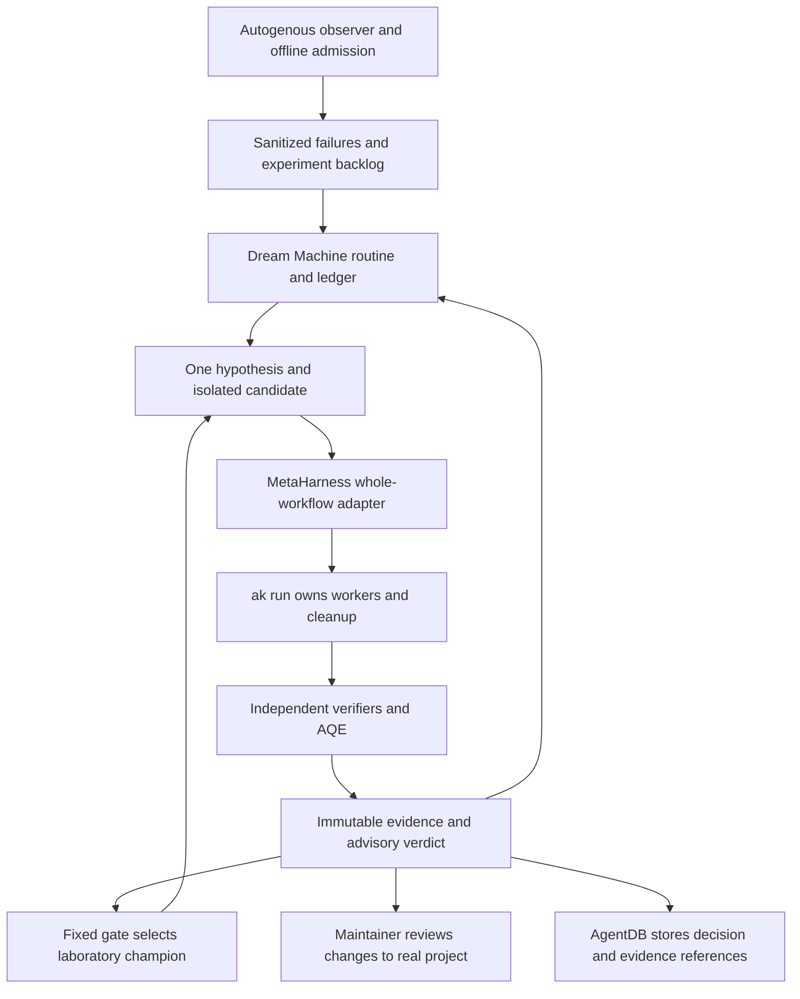

# Adopting Dream Machine, MetaHarness, and Autogenous in agentic-kit

The companion [technical implementation plan](implementation-plan.md) defines concrete modules, contracts, task dependencies, tests and operational gates for this recommendation.

**Recommendation:** build an autonomous experimentation system around agentic-kit: observe continuously, research nightly, evaluate candidates in parallel, retain failures as learning, and automatically select better candidates inside a preapproved experimental boundary. Use MetaHarness for evaluation/evolution, Dream Machine for repeatable research cycles, and Autogenous for typed proposals and incident-driven experiments. Keep `ak run` responsible for execution and keep real project configuration, permissions, deployment, and release decisions with their existing owners.

The highest-value first experiment is a **worker-lifecycle regression laboratory**: reproduce timeout, cancellation, malformed handoff, and cleanup failures; compare candidate fixes or route choices against a fixed baseline; retain both successful and rejected hypotheses. This is closely tied to agentic-kit's product purpose and can demonstrate value before introducing autonomous scheduling or learned routing.

The selected priority is **maximum autonomous learning and experimentation**. The design therefore minimizes repeated human decisions inside a fixed research boundary, while requiring evidence before that boundary expands. Findings were checked on September 12, 2026 against live GitHub source, documentation, npm metadata and selected published tarballs. Local project observations refer to `142f76830bcbd462bfacd23b531d644abfcfe72e`, version `4.0.0-alpha.48`. Recommendations and effort estimates are engineering judgments; upstream performance claims are not measurements of agentic-kit.

**1. What each project would contribute.** Assign each component a specific responsibility.

| Project | Concrete role here | Initial adoption | Expected output |
| --- | --- | --- | --- |
| MetaHarness | Independently evaluate complete `ak run` workflows; evolve permitted experimental parameters | First: external evaluation and candidate-selection loop | Outcome records, verifier results, comparative evidence, laboratory champions |
| Dream Machine | Compile repository-specific research routines and retain experiment history | Second: qualify manually, then nightly and event-triggered experiments | Hypothesis, baseline, candidate, verdict, evidence, ledger entry |
| Autogenous | Represent adaptations with explicit authority, invariants, expiry, evidence, and rollback; observe incidents | Third: observation and automated offline proposal/evaluation | Incident records, replay measurements, admitted or rejected typed proposals |
| Ruflo | Coordinate its own workflows and operate its own retrieval flywheel | Retain existing ownership | Coordination state and, where supported, Ruflo-issued evaluation/promotion evidence |
| Agentic QE | Generate and execute relevant quality checks | Retain existing integration | Tests, adversarial cases, regression evidence |
| AgentDB | Preserve project decisions and learning references | Retain existing ownership | Searchable decisions and links to authoritative experiment artifacts |

These products overlap, but they are not interchangeable. Dream Machine's compiler produces instructions; MetaHarness supplies evaluation and evolution components; Autogenous supplies governed-adaptation primitives. None currently supplies the complete agentic-kit integration described below. A **laboratory champion** means the preferred candidate for subsequent sandbox experiments, not a production route, released artifact, or authorization grant. [Dream compiler][D2], [MetaHarness worker contract][M2], [Autogenous workspace][A1], [existing companion proposal](../METAHARNESS-COMPANION-PROPOSAL.md).

**2. Source and release reality.** The inspected revisions and published artifacts differ.

| Component | Source examined | Published package observed | Material qualification |
| --- | --- | --- | --- |
| Dream Machine | `3edd426f6c9c4b1e80235f7447dc863e749345cc`, September 7 | `dream-machine@0.1.1`, August 13 | Newer source freshness and governance commands are absent from that npm CLI |
| MetaHarness | `d5833dc6512ac1adeeef91a331c29055cd8a4dbb`, September 5 | `metaharness@0.4.16`, September 2 | Current source fixes MCP configuration discovery beyond what the package contains |
| Darwin | Same MetaHarness checkout | `@metaharness/darwin@0.10.2` | Includes numeric evolution as well as prompt-policy evolution |
| Flywheel / Router / RedBlue | Same MetaHarness checkout | `@metaharness/flywheel@0.1.11`; `@metaharness/router@0.4.0`; `@metaharness/redblue@0.1.6` | Separate packages and contracts; their presence does not establish working Ruflo integration |
| Autogenous | `7bf327a9754ce798364dbee8b2825af42a421fd4`, September 1 | Rust source workspace; separate `radio-moe@0.3.1` | Published Radio-MoE tarball lacks newer receipt-export code found at HEAD |
| Ruflo | `b02c0cacec225deea01f586b66a9694393369432`, September 12 | Workstation has `ruflo@3.41.2` | Repository HEAD, installed CLI, plugin cache, and downstream package versions are distinct facts |

The repositories use MIT licensing. Capture licenses, resolved versions, package integrity hashes, source revision, lockfile, runtime, and OS for an actual pilot. Prefer a tested release; use a reviewed source checkout where a required fix is unreleased. A floating `latest` reference is unsuitable as the identity of a baseline experiment. [Dream package][D1], [MetaHarness package][M1], [Autogenous manifest][A1], [Dream registry][N1], [MetaHarness registry][N2], [Darwin registry][N3], [Flywheel registry][N4], [Router registry][N5], [RedBlue registry][N6], [Radio-MoE registry][N7].

Two documentation corrections materially affect the recommendation. Older Autogenous ADRs describe a largely unbuilt architecture, but current source contains fifteen Rust crates including a service and ledger. Conversely, older claims of Dream Machine RVF memory should not be carried forward: its current memory implementation uses flat-file keyword recall and explicitly leaves RVF unimplemented. Read source and the specific artifact together. [Autogenous workspace][A1], [Dream memory][D5].

**3. Fit with the current agentic-kit architecture.** [ADR-0022](../adr/0022-metaharness-as-optional-assurance-companion.md) already proposes MetaHarness as an external companion. It remains **Proposed**. The documentation merge did not implement the adapter or accept the architectural decision. Revise it to add Dream Machine/Autogenous boundaries and explicitly authorize automatic laboratory selection under a fixed experiment policy. That is an amendment to the earlier advisory-only direction, not authority implied by its old documentation merge. There is still no need to resurrect the retired `ak improve` command.

The existing source provides strong integration seams:

| Existing implementation | Reuse | Required addition |
| --- | --- | --- |
| [`src/commands/run.mjs`](../../src/commands/run.mjs) | Canonical route overrides, plan construction, execution, JSON output | A versioned, sanitized companion export |
| [`src/lib/execution/runner.mjs`](../../src/lib/execution/runner.mjs) | Dependency ordering, deadlines, escalation, cancellation, cleanup | External whole-run adapter and total-run budget; preserve internal ownership |
| [`src/lib/execution/schema.mjs`](../../src/lib/execution/schema.mjs) | Terminal categories and observed/configured provider/model distinctions | Explicit export limits, cost evidence categories, artifact identity |
| [`src/lib/live/event-schema.mjs`](../../src/lib/live/event-schema.mjs) | Versioned metadata events built field by field | Optional observer bridge using a further restricted subset |
| [`src/lib/live/transcript-streams.mjs`](../../src/lib/live/transcript-streams.mjs) | Existing transcript handling and masking | Do not reuse transcript text as default training/evaluation export |
| [`src/lib/adapters/companion-registry.mjs`](../../src/lib/adapters/companion-registry.mjs) | Existing opt-in companion pattern, currently for deja-vu | Possible later managed integration after the external pilot proves useful |

There are two subtle contract gaps. First, `ak run --json` emits `{plan, results}` without a top-level schema version, and the plan contains task-derived prompts. The omission of runtime handoffs does not make the whole JSON document safe to export. Second, `--timeout` is a budget **per worker attempt**, not a deadline for the complete workflow; sequential workers and escalation can extend total elapsed time. The companion must add an overall limit and verify process-tree cleanup without becoming another scheduler for individual workers. [Run command](../../src/commands/run.mjs), [runner](../../src/lib/execution/runner.mjs), [routing templates](../../src/lib/routing.mjs).

The workstation already reports Node `26.4.0`, pnpm `11.17.0`, Ruflo `3.41.2`, Agentic QE `3.14.1`, AgentDB `3.0.0-alpha.17`, and RuVector `0.3.0` through package inventory. These observations do not prove login, entitlement, or runtime health. Dream Machine source declares Node 22/24 support, so use an isolated Node 24 tooling environment rather than assuming the workstation's Node 26 is supported. Existing activity routes already select Claude for architecture/review and Codex for implementation/testing; this supplies a concrete comparison baseline without inventing another routing authority. [Dream runtime declaration][D1], [host ownership decision](../adr/0051-supported-peer-delegation-and-host-realignment.md).

**4. MetaHarness: the best first investment.** MetaHarness's most useful role is to answer: “Did this complete workflow produce a correct, useful result, at an acceptable cost and latency?” Prefer its benchmark-agnostic Flywheel evaluator API around one complete `ak run`; this avoids importing a second orchestration layer just to measure results. If the full harness control plane is needed, its `Worker` function accepts structured input and returns output plus quality, confidence, risk, cost, and latency. Both approaches require a new subprocess adapter. Keep the pipeline indivisible; do not register its internal workers with another scheduler. [Flywheel API][M9], [Worker types][M2].

Use four different kinds of evidence, each with its own label:

- **Static fit:** `metaharness score` and `genome` describe repository signals and a recommended harness. A high tool-safety dimension is not an audit of the current running stack.
- **Configuration audit:** inspect actual MCP and tool-policy files. A missing `.harness/mcp-policy.json` is not automatically an agentic-kit vulnerability.
- **Deterministic verification:** repository tests and AQE establish specific code and integration behavior.
- **Empirical outcomes:** held-out tasks measure whether workflows succeed, how long they take, and what resource evidence is available.

Keep these separate in reports and future UI. A static fit score should not become a release gate. The current estimated cost calculation uses a fixed assumed token count and price, rather than measuring this workstation's provider or subscription charges. [Scorecard implementation][M3], [ADR-0022 interpretation rules](../adr/0022-metaharness-as-optional-assurance-companion.md).

The current published `metaharness@0.4.16` threat-model implementation misses an MCP configuration shape addressed on September 5 in source: `.claude/settings.json` `mcpServers`. This matters in a dual-host project. Inventory the actual configuration locations independently until the audited package contains the fix. [Current threat-model source][M4].

**Routing learning comes after labels.** Begin with automatic comparisons of eligible route policies on the same task corpus. Record task-family success, retry count, latency, observed provider/model, and resource usage. Only then consider `@metaharness/router`: it needs labeled examples plus a consistent embedding source and prices; it does not supply embeddings or provider calls by itself. Retrain and evaluate offline automatically, select a laboratory policy when independent gates pass, and keep recommendations for real user defaults advisory. Apply accepted production routes through existing `ak` controls. [Router package][M5], [companion proposal](../METAHARNESS-COMPANION-PROPOSAL.md).

**Flywheel provides a better starting point than a custom evolution engine.** Its API accepts the policy, proposer, evaluator, holdout, anchor, and promotion rule, and produces lineage and receipts. Require the optional anchor, independent held-out acceptance, and explicit trusted signer policy. Its budget check happens at generation boundaries, so add pre-call reservations and a hard external budget. Replay validates recorded evidence; it does not rerun original workflows. Laboratory selection must be a supplied gate over genuine verifier results, not acceptance of a signed self-report. [Flywheel API][M9], [run budget][M10], [replay][M11].

The API's `holdout` is repeatedly used in candidate selection; treat it as development validation, not permanently unseen acceptance data. Keep a separate acceptance set and control repeated testing against it. The stock promotion rule requires improved no-op rate but can allow unchanged primary quality and has no significance test. Supply a task-specific, frozen gate that requires the intended improvement and preserves every hard constraint. [Default gate][M12].

**Darwin has more capability than older descriptions suggest.** In addition to seven approved prompt-policy files, version `0.10.2` supports bounded numeric genomes with an external JSON evaluator. This can later explore companion context-selection weights or other explicitly permitted parameters. The numeric evaluator inherits its parent's environment; its own subprocess timeout is not a complete sandbox, and numeric winner selection does not supply an independent statistical or cost gate. Start with ordinary parameter sweeps, add Darwin only when it outperforms that baseline, and hold permission ceilings, budgets, hidden tests, and acceptance rules fixed. [Prompt mutation surfaces][M6], [numeric evaluator][M7], [numeric evolution][M8].

**5. What Ruflo's MetaHarness documentation means here.** Ruflo supplies a CLI/plugin bridge to MetaHarness and separate retrieval-flywheel code. The relevant reading trail is ADR-150, the MetaHarness CLI guide, ADR-322 and its later contract work, the witness-receipt specification, and the actual command/plugin implementations. These describe different boundaries; a standalone MetaHarness report is not a Ruflo promotion receipt. [CLI bridge][R1], [plugin helper][R2], [receipt contract][R3].

A significant operational detail is that the plugin helper currently requests `metaharness~0.3.0`, resolves a compatible local package, and otherwise installs into a versioned cache. The workstation already has a `0.3.2` cache. A seemingly read-only wrapper can therefore install software on first use and can execute a different version from a separately installed `0.4.16` CLI. For reproducible evaluation, select and record one explicit executable path and inspect the installed schema. [Resolution and installation code][R2].

Ruflo's current retrieval-flywheel wiring also needs a capability check: the explicit Darwin proposer requires an injected invoker that the inspected CLI path does not supply. Package installation alone does not complete that connection. Use explicit `--proposer local` for a supported local retrieval experiment, rather than assuming Darwin is connected. Foreign projects also need a pinned project anchor manifest with labeled retrieval tasks. This particular Ruflo workflow evaluates retrieval policy; the standalone Flywheel library is broader. [Runtime wiring][R4], [proposer][R5], [project anchor][R6].

Keep Ruflo authoritative for its ledger, champion, signatures, serving epoch, and promotion transaction. A future agentic-kit dashboard can read those facts with provenance. It should not copy the state into `kit.json`, generate competing signing identities, or treat any upstream success response as permission to change routes or publish a release. [ADR-0022](../adr/0022-metaharness-as-optional-assurance-companion.md), [receipt specification][R3].

**6. Dream Machine: useful experimental discipline, incomplete operating controls.** The implemented core compiles a repository configuration into a research routine, manages a ten-column ledger, derives learning signals, constructs scheduling payloads, and hashes reports with source identifiers. Candidate implementation and evaluation happen in the executing agent session and optional backends. Compilation itself does not execute a complete improvement loop. [Compiler][D2], [ledger][D6], [witness][D7].

For agentic-kit, rotate through worker lifecycle, configuration ownership, provider provenance, and footprint. Each cycle should select one falsifiable hypothesis, freeze the evaluator, construct a candidate in isolation, compare against its exact parent, and record `ACCEPT`, `REJECT`, or `INCONCLUSIVE`. A rejected hypothesis is valuable if it prevents repeated investigation. Footprint measurements belong only to footprint hypotheses; they cannot substitute for quality or security results. [Configuration][D3], [repository benchmark](../../scripts/benchmark-footprint.mjs).

Do not execute the stock routine unchanged:

- `autoMerge:false` still leaves instructions to publish a public gist, issue, commit, push, and draft PR. There is no structured local-only publication setting, dollar budget, or total deadline in `DreamConfig`; `extraDisciplines` adds prose rather than enforcing capabilities. [Config schema][D3], [publication steps][D2].
- `dream-machine schedule` only constructs JSON. Its default body includes broad tools, `enabled:true`, and placeholder environment information; it does not register a cloud routine or verify the current scheduler contract. [Schedule implementation][D4].
- The bundled GitHub Actions research-lite script does not perform candidate evaluation. It sends the repository name and research surfaces to OpenRouter, always concludes `INCONCLUSIVE`, and can call the provider before its `--dry-run` branch. Its later Git operation includes `--force-with-lease`. This is not the appropriate pilot runner. [Research-lite script][D8].
- Basic witnessing is hash-based integrity evidence, not an authenticated authorization signature. HEAD alone misses dirty or untracked inputs. The research-lite script also appends metadata after hashing its report, so an exact-byte check of the final file needs careful treatment. Prefer an immutable evidence object plus a separate receipt. [Witness implementation][D7], [report construction][D8].

Newer source includes read-set freshness checks: it can detect when files used in an evaluation have changed even if those files are outside the candidate diff. That is particularly relevant to long-lived proposals, but it is absent from the older published CLI. [Evidence freshness][D9].

For scheduling, distinguish Dream Machine's payload generator from Anthropic's service. Current Claude routines run in fresh cloud checkouts and consume subscription allowance; account limits and optional metered overage still apply. Their connected tools may write without an interactive approval prompt. Local workstation tools, AgentDB files, and Codex authentication do not automatically appear in that environment. Use a local manual qualification first; for unattended maximum availability, move the qualified loop to a dedicated runner or supported cloud environment with both required hosts actually provisioned. A local desktop schedule depends on an awake machine. [Claude routines][C1], [local scheduled tasks][C2].

**7. Autogenous: valuable governance primitives, observer-only initially.** Autogenous now has concrete Rust implementations of genomes, typed mutations, authority classes, invariant checks, detector replay, signed evidence, promotion envelopes, canary state, deployment-adapter rollback, and a durable ledger. Its useful idea is to make every adaptation state what it changes, the authority it needs, the evidence supporting it, its applicability and expiry, and how to undo it. Constitutional changes remain outside automatic admission. [Workspace][A1], [typed admission][A2], [promotion envelope][A3], [deployment adapter][A4].

Three practical uses fit agentic-kit:

1. **Offline proposal validation.** Express a proposed companion-policy change as a typed mutation and reject authority expansion, missing rollback, expired applicability, or unsupported evidence before spending on an evaluation.
2. **Replay-based incident research.** Feed synthetic or explicitly redacted event streams to detectors for repeated retry storms, suspicious tool-output patterns, or provenance anomalies; measure false positives against benign cases.
3. **Autonomous experiment triggers.** An incident queues a reproducible fixture and a scoped candidate for a later Dream cycle. Autogenous's deterministic generator can propose detector variants without seeing evaluator labels; evaluate them automatically on training and held-out replay. The observer does not cancel real workers, rewrite default routes, or block user traffic in the first pilot. [Detector generator][A11].

Those are proposed integrations, not existing adapters. The current metadata event schema is a better starting point than raw transcript text. Content-based injection detection requires a separately authorized content corpus; metadata alone cannot support that claim. [Agentic-kit event schema](../../src/lib/live/event-schema.mjs), [MidStream adapter][A5], [evaluator][A6].

The incident-to-candidate connection needs a privacy-approved sample resolver: incidents carry fingerprints and matched-condition metadata, while the generator needs `AttackEvidence.sample`. Resolve an original synthetic fixture or an explicitly retained sanitized sample by incident/trace identity. Fingerprint-only telemetry cannot reconstruct that input. [Observer input/output][A5], [generator input][A11].

The present source has material limits before promotion authority would be appropriate:

- The HTTP service binds to `0.0.0.0:8080` by default, and its application route construction has no authentication middleware. It falls back to deterministic development signing seeds when configured seeds are absent or invalid. An external deployment may add protections, but these source defaults are unsuitable for an exposed authority service. [Service initialization and keys][A7].
- `drive_canary` discards checkpoint-save errors and sets `promoted = true` before discarding a possible `record_promotion` error. Durable primitives exist, but this composition does not reliably fail closed when persistence fails. This is a static source finding, not a claim that every deployment is exploitable. [Runtime persistence path][A8].
- The newer Radio-MoE receipt exporter explicitly discloses no separate promotion holdout, zeroed resource evidence, and authorization/reversibility terms marked as trusted assertions. Its signature proves origin under a key; it does not establish Ruflo authorization. That exporter is also absent from the published `radio-moe@0.3.1` tarball. [Receipt-export limitations][A9].

The new numerical-regression candidate format broadens future experimentation, but signed numeric metrics do not execute an evaluator and do not automatically carry the detector profile's safety gates. Supply independent quality and authority checks. ADR-403 also leaves real production-traffic canaries, a non-reference deployment adapter, and execution-resource enforcement unfinished; an in-memory acceptance example does not establish real deployment rollback. [Regression candidates][A12], [execution-loop status][A13].

Do not deploy Radio-MoE as another host orchestrator here: it would overlap with existing `ak`/Ruflo responsibilities. An optional later use is read-only comparison of signed reviewer claims, preserving real provider independence and evidence rather than counting agreement alone. Do not assume a TypeScript package supplies the Rust runtime. Keep Rust outside agentic-kit's npm dependency graph. No ready-made stdio/MCP/WASM bridge for the Rust observer was found; a narrow wrapper around the actual library is new work. Upstream synthetic benchmarks are not predictions of end-to-end latency, incident recall, or safe rollback in this project.

**8. Target operating model.** The complete loop connects experimentation, evidence, and learning.



The diagram describes a proposed integration. Use one correlation ID across the experiment, run, verifier results, and decision. Keep distinct authoritative stores: Dream ledger for experiment history; AgentDB for project learning references; MetaHarness for evaluation artifacts and laboratory lineage; Ruflo for its own flywheel; agentic-kit for lifecycle/configuration ownership. Avoid a universal database that quietly takes ownership of all five domains.

The preferred autonomy policy has three boundaries:

| Boundary | Allowed automatically after one-time policy approval | Separate authorization required |
| --- | --- | --- |
| Research and experiments | Recall, deduplicate, choose hypotheses, fetch allowed public sources, create isolated candidates, run verifiers, record every outcome | New data destinations, credentials, provider access, larger resource ceilings |
| Laboratory learning | Train advisory models, generate detector candidates, select a reversible experimental champion, revert it after anchor regression | Changing hidden tests, score rules, trust roots, safety invariants, permission or spending limits |
| Real project and deployment | Prepare reviewable patch/evidence; create draft PRs only if explicitly preauthorized | Merge/release, default route changes, host projections, production intervention |

Use continuous metadata observation, event-triggered replay after upstream/version changes, and one full research cycle nightly. Within the active session's four-agent limit, a coordinator can run up to three independent experiment lanes; configure fewer when resource budgets require it. Each writing lane gets its own worktree. This is a proposed deployment shape, not a claim that background workers are running now.

Cap provider spend, wall time, candidate count, and concurrent runs mechanically. Start with one hypothesis per cycle and two to four candidate variants, rather than immediately using the upstream prompt's full population. When the PR review queue is full, continue offline evaluation, rejected-hypothesis analysis, and evidence collection; pause new proposal publication instead of turning learning off. Automatically suspend a failing executor or leaking exporter while preserving completed evidence.

**9. Prerequisites and additional tools.** Add tools by stage instead of installing the entire ecosystem.

| Requirement | Why it is needed | Initial scope |
| --- | --- | --- |
| Isolated Node 24 environment and existing pnpm | Supported common tooling baseline, separate from current Node 26 | Required for the tooling pilot |
| Git, dedicated experiment worktrees, one writer per worktree | Reproducible parent/candidate comparisons and collision prevention | Required |
| Separate companion workspace with its own package/lockfile | Preserve agentic-kit's zero-runtime-dependency distribution | Required |
| `metaharness` and `@metaharness/flywheel` | Static reports and benchmark-agnostic evolution; full harness library is optional | First stage |
| `dream-machine` or reviewed source build | Routine compilation, ledger, witness, later scheduling | Second stage |
| Existing Ruflo, AQE, AgentDB | Coordination, quality work, project memory | Reuse; capability-check instead of reinstalling |
| `@metaharness/router` and a versioned embedding source | Learned quality/cost predictions and offline policy selection | After representative labels exist |
| `@metaharness/darwin` and optional RedBlue/Flywheel | Bounded candidate exploration and targeted evaluation | Add only for a justified experiment |
| Stable Rust, Cargo, rustfmt, clippy; cargo-audit for its CI gate | Build and verify Autogenous; manifest minimum is Rust 1.74, CI uses stable | Only for Autogenous pilot |
| Authenticated allowed hosts and verified provider identity | Real `ak run` outcome evaluation | Before model-backed tests |
| GitHub integration and selected scheduler environment | Remote routines and authorized proposal publication | Later, not needed for local reports |

No model API key is needed to inspect source, compile Dream configuration, perform static fit analysis, or run deterministic Rust tests. Existing subscription-backed host execution consumes its plan allowance. Direct provider evaluations require that provider's credentials and explicit spending authority; `OPENROUTER_API_KEY` is not a blanket prerequisite for this architecture. Do not inject provider credentials into ordinary subscription workers as a fallback.

Before any provider-enabled batch, define maximum workflow duration, attempt count, concurrency, token or provider budget, and permitted network destinations. Record unavailable cost as unknown; token counts and subscription usage are still useful. MetaHarness's worker contract expects numeric `costUsd`, so the adapter must define a conservative reservation/estimate policy or disable cost-driven selection when costs cannot be represented honestly. Never silently encode unknown as measured zero. [Worker output contract][M2].

**10. Step-by-step delivery plan.** Implement the shared evidence boundary first, then close the autonomous experiment loop.

1. **Approve a durable autonomy envelope.** Revise ADR-0022 with the three companion roles, automatic laboratory selection, allowed source and policy paths, budgets, evidence categories, retention, and prohibited mutation surfaces. Approve the experiment class once so individual in-bound cycles need no repeated permission. This research request has not itself enabled any automation. Acceptance: reviewed rules distinguish laboratory evolution from real-world application and require zero new agentic-kit runtime dependencies.

2. **Create and qualify the companion environment.** Use a sibling workspace and a clean baseline checkout. Resolve versions once, record package integrity and source identity, inspect executable help, and test optional-backend absence. Do not run a scaffold over `AGENTS.md`, `CLAUDE.md`, MCP settings, or host projections. Acceptance: removing the companion leaves core `ak` commands usable.

3. **Capture deterministic baseline evidence.** Run focused execution, handoff, routing, and ownership tests, plus footprint measurements where relevant. Capture OS/runtime, commit, lockfile, workload, and raw result digests. Follow with normal repository checks for a real implementation. Acceptance: another run can reproduce the baseline, and a deliberately broken fixture is rejected.

4. **Implement the export contract.** Add a new versioned result DTO/schema near `src/lib/execution/`, expose it through the existing run command under an explicitly designed opt-in export mode, and test it in `tests/kit/`. Suggested files are `companion-result.mjs`, `companion-result.schema.json`, and `companion-result.test.mjs`; these are proposed names, not existing APIs. Export only run ID, source identity, terminal status, attempt/timing/cleanup evidence, safe provider/model provenance, usage classification, and artifact digests. Exclude prompts, handoffs, raw streams, environment, credentials, absolute private paths, and arbitrary failure text.

5. **Build the external one-run adapter.** Wrap the fixed `ak` executable for the Flywheel evaluator, or implement MetaHarness's `Worker` contract if using the full harness. Use a literal argument array, explicit cwd, bounded output and environment, no shell interpolation, and an overall deadline. Retrying a write-producing pipeline must use a fresh isolated candidate or established idempotency. Map permission/authentication failures, timeouts, malformed output, orphaned children, and unknown schema versions to truthful non-success states. Acceptance: failure injection proves cancellation and cleanup across the process tree on supported operating systems.

6. **Run a small shadow comparison.** Start with 20–30 representative tasks across 4–5 families, each evaluated against the same baseline and candidate policy; repeat enough to expose variability. This is a pilot workload, not a universal sample-size rule. Keep a separate unseen acceptance set. Use deterministic artifact checks first, independent review where necessary, and quality floors that cannot be traded for lower cost. Acceptance: source-bound results show sample size, uncertainty, failure modes, and no configuration writes.

7. **Add Dream Machine compilation and local history.** Configure rotation, evaluator commands, correct `docs/adr` numbering, and ledger location. Compile into an evidence directory and inspect the entire output. Before executing it, add an upstream publication-policy seam or an explicitly named companion adapter that enforces local-only output and bounded execution. `extraDisciplines` alone does not satisfy this requirement. Acceptance: a routine requesting a public gist or push is denied without losing the local experiment record.

8. **Conduct three to five manual Dream cycles.** One hypothesis per cycle, one candidate writer, exact parent baseline, frozen verifier, and an honest terminal verdict. Recheck evaluation input freshness before accepting a result. Store an immutable report, separate receipt, and AgentDB reference. Acceptance: useful results include rejected hypotheses and actionable failures; repeated duplicate findings or unverifiable claims stop expansion.

9. **Enable nightly and event-triggered experimentation.** After manual qualification, schedule the full research cycle nightly and trigger focused replay on observed failures or dependency/host changes. Use up to three independent lanes plus a coordinator when the session permits four agents. Limit pending external proposals separately from local experiments. For cloud or a dedicated runner, provision Node/pnpm, repository access, both hosts, network/tool policy, persistent evidence, and subscription/budget controls. A cloud session lacking Codex is a different experimental environment. Acceptance: overlap prevention, budget exhaustion, missing credentials, pause/disable, and interrupted-run recovery are demonstrated.

10. **Close the autonomous learning loop.** Compare explicit policy variants, then train the learned router and use Darwin to explore approved companion parameters. Automatically promote a candidate to laboratory champion only after independent holdout and fixed anchor gates pass, and automatically revert on subsequent anchor regression. Preserve rejected lineages and uncertainty. Keep real default routes unchanged until applied through the normal configuration process. Acceptance: the loop learns from its own recorded outcomes without changing its evaluator, authority, budget ceilings, or hidden corpus.

11. **Add autonomous incident-to-candidate research.** Build Autogenous separately, run its checks, and feed synthetic/restricted records into admission and replay. Connect the real detector generator to a segregated training corpus, keep evaluation labels hidden, and queue admissible variants for automatic evaluation. Introduce the observer bridge only if replay adds value. Keep incidents advisory to real execution and use the proven companion selection gate rather than the runtime persistence path identified above. Acceptance: false-positive and resource budgets hold, proposals remain in approved laboratory paths, and removal leaves execution unaffected.

12. **Consider product integration after recurring use.** A later ADR can add capability discovery and read-only dashboard/status evidence through the existing companion lifecycle pattern. Promotion-capable Autogenous integration first requires authenticated service boundaries, pinned independent trust roots, fail-closed persistence, meaningful held-out evidence, deployment-specific rollback tests, and a clearly designated external authority. This is a separate engineering project, not the last configuration switch of the pilot.

The implementation plan follows dependency order: stable evidence before optimization, a proven manual workflow before scheduling, and observation before runtime intervention. Once those gates pass, routine experimental work proceeds automatically. No proposed command or file in this section is claimed to exist already.

**11. Concrete setup examples for a later authorized pilot.** These commands are preparation examples, not actions performed by this report. Run them in a new companion workspace with its own Node 24 environment. The versions are the inspected snapshot; reassess and lock any newer selection before comparing results.

```bash
mkdir -p ../agentic-kit-lab
cd ../agentic-kit-lab
npm init -y
npm install --save-exact metaharness@0.4.16 @metaharness/flywheel@0.1.11 dream-machine@0.1.1
```

The installed Dream CLI provides the older core. If current freshness/governance features are required, build the reviewed September 7 source in a separate checkout instead. Do not combine source-only commands with the older npm CLI in the same runbook. Keep the MetaHarness MCP discovery limitation noted above until an audited release includes its fix.

After installation and inspection of local help, static preparation can use:

```bash
./node_modules/.bin/metaharness score ../agentic-kit --json
./node_modules/.bin/metaharness genome ../agentic-kit --json
./node_modules/.bin/harness mcp-scan ../agentic-kit --json
./node_modules/.bin/harness threat-model ../agentic-kit --json
./node_modules/.bin/dream-machine init --repo pacphi/agentic-kit --out dream.config.json
./node_modules/.bin/dream-machine compile dream.config.json --out PROMPT.md
```

The actual Flywheel configuration contract provides the following implementation checklist. Populate it only after the evaluator, signer ownership, and persistence boundary exist; no working agentic-kit config ships upstream:

| Field | Required implementation |
| --- | --- |
| `rootPolicy` | Named string-valued policy fields; validate any encoded numerical values |
| `proposer` | Async function returning a replacement target value, optionally with summary/inverse metadata |
| `evaluator` | Async function mapping policy plus suite to `primary`, `noopRate`, `costPerWin`, and `regressed` |
| `holdout` | `{id, items}` for development selection; maintain unseen acceptance separately |
| `maxGenerations` | Fixed experimental population budget, coupled to an external resource limit |
| `signer` | `sign(payload)` and `publicKey()` with explicit laboratory trust ownership |
| `anchor`, `promotionRule`, `mutationTargets`, `budget` | Require these optional upstream controls in the companion's policy |
| `onGeneration`, later `resumeFrom` | Persist each completed generation and resume from validated, source-compatible state |

[Flywheel API and examples][M9]. Add `@metaharness/darwin@0.10.2` when enabling candidate evolution, `@metaharness/router@0.4.0` when labels support routing learning, and `@metaharness/harness@0.2.0` only if choosing the full worker/control-plane API. Keep these dependencies in the companion workspace.

Replace the generated Dream defaults before compiling a real experiment. This example uses actual current schema fields, aligns the ADR directory with agentic-kit, and deliberately avoids pretending that missing publication/budget controls are supported configuration:

```json
{
  "repo": "pacphi/agentic-kit",
  "cron": "0 10 * * *",
  "slots": [
    { "deep": "worker-lifecycle", "scan": ["deadline-cancellation", "cleanup-evidence"] },
    { "deep": "configuration-ownership", "scan": ["sync-idempotence", "projection-provenance"] },
    { "deep": "routing-evidence", "scan": ["provider-attribution", "context-budgets"] }
  ],
  "buildStep": {
    "cmd": "pnpm install --frozen-lockfile && pnpm run build",
    "degradeOnWasmFailure": false
  },
  "controlPlaneProbes": ["node bin/agentic-kit.mjs --help --all"],
  "evaluatorEntrypoints": { "bench": "pnpm run benchmark:footprint" },
  "adrConvention": { "pad": 4, "dir": "docs/adr" },
  "extraDisciplines": [
    "Follow AGENTS.md and ADR-0022; publish and promote only under separately granted authority."
  ],
  "ledgerPath": "docs/dream-cycle/LEDGER.md",
  "branchPrefix": "dream/",
  "labels": ["dream-cycle", "research"],
  "autoMerge": false
}
```

This configuration was checked against current source `validateConfig()` and produced no errors or warnings. It is **a compiler-input example, not a safe-to-execute routine**. The compiled prompt still contains publication steps. The shown `bench` entry is valid only for footprint experiments; provide a dedicated immutable evaluator for lifecycle or route-quality experiments. The example cron is UTC in Dream Machine; confirm actual scheduler timezone behavior when configuring the job. [Configuration][D3], [scheduler][D4].

For Autogenous, use a separate source checkout and current stable Rust. Its project checks include:

```bash
cargo fmt --all --check
cargo clippy --workspace --all-targets -- -D warnings
cargo test --workspace
```

Add its `cargo audit` gate with the corresponding tool installed. Begin with library tests/examples, not an exposed `autogenous-service`. A production service needs authentication, trust-root provisioning, and persistence fixes; setting `PORT` does not change its all-interface bind. [Autogenous CI][A10], [service][A7].

**12. Verification and success measures.** Use a small, fixed acceptance matrix rather than one composite score:

| Question | Measure | Initial acceptance principle |
| --- | --- | --- |
| Does a workflow solve the task? | Held-out artifact/verifier success by task family | No safety/correctness regression; report uncertainty |
| Is a route cheaper in practice? | Observed or explicitly estimated cost per successful task, plus tokens/retries | Unknown price stays unknown; compare within equivalent billing assumptions |
| Does it finish reliably? | Completion rate, elapsed distribution, timeout/orphan counts | No success after failed cleanup; independent total-run limit |
| Is the research useful? | New reproducible findings, duplicate rate, review minutes, rejected hypotheses retained | Stop when review burden exceeds benefit |
| Is evidence trustworthy? | Source/data/evaluator identities, valid schema, redaction, freshness | Reject missing, stale, or oversized evidence |
| Does observation help? | Incident precision/recall on labeled replay; false positives; added latency/memory | Observer remains outside the execution critical path initially |
| Can it be removed? | Core command behavior after companion removal | No required runtime dependency or orphaned configuration |

For a code implementation, first run focused tests such as execution-runner, execution-handoff, adapter ownership, and routing suites. Then run the repository's relevant static/build checks and full test gate; include UI verification only when UI behavior changes. The package currently enforces 70% line/branch/function floors, while project guidance targets 80% line coverage. Report actual measurements and any gap; neither this research nor an upstream test count establishes that agentic-kit passes those gates.

Test export confidentiality with adversarial fixtures, including secrets in failure strings, malicious nested JSON, oversized records, unknown versions, private paths, and raw handoffs. Test adapter behavior when hosts require authentication/permission, emit malformed JSON, hang, spawn descendants, or fail during cleanup. For future promotion work, inject disk-write failure and restart between decision and durable recording; this specifically addresses the Autogenous source issue found during research.

**13. Effort and expected experience.** These are planning estimates for one experienced maintainer, not upstream delivery promises:

| Stage | Estimated effort | What becomes usable |
| --- | --- | --- |
| Boundary decision, isolated tools, baseline corpus | 2–3 engineering days | Reproducible static and deterministic reports |
| Export contract and whole-run adapter | 3–5 days | Bounded shadow comparisons with source-bound evidence |
| Dream local-output controls and manual cycles | 2–4 days | Repeatable experiment history without automatic publication |
| Nightly/event-driven pilot and label collection | 1–2 days setup, then 2–4 weeks observation | Recurring autonomous experiments, outcomes and proposal preparation |
| Autogenous observer/admission proof of concept | 3–5 days | Automated incident-to-detector proposals and offline replay |
| Production promotion authority | Not responsibly estimable from configuration alone | Requires a separate security, durability, and deployment design |

The first visible benefit should be better evidence and fewer repeated investigations. Once qualified, the system should choose the next experiment, evaluate permitted variants, update laboratory preferences, and retain unsuccessful branches without intervention. A typical report might say: “Candidate B became the laboratory champion on the frozen corpus; two held-out tasks still fail; provider cost is unknown; the default route is unchanged.” A Dream cycle should leave one complete record even when no change is worth accepting. An Autogenous observer should turn a reproducible incident into a scoped experiment rather than quietly intervening in real work.

Do not promise percentage cost savings, automatic model improvement, production-grade self-repair, or daily mergeable PRs. Those outcomes depend on workloads, labels, verifiers, environment, and review capacity. The most defensible first milestone is **one independently verified improvement—or one confidently rejected hypothesis—produced through a removable, bounded companion workflow**.

**Source register.** GitHub links are pinned to inspected commits. npm links are live registry records checked September 12, 2026. Source and selected package artifacts were inspected; no upstream full test suite, live model benchmark, optional-tool installation, scheduled run, or promotion was performed for this report.

- Dream Machine: [workspace manifest][D1], [compiler][D2], [configuration][D3], [scheduler][D4], [memory][D5], [ledger][D6], [witness][D7], [research-lite script][D8], [freshness verification][D9].
- MetaHarness: [CLI manifest][M1], [worker API][M2], [static scorecard][M3], [MCP threat-model discovery][M4], [router][M5], [Darwin prompt surfaces][M6], [numeric evaluator][M7], [numeric evolution][M8], [Flywheel API][M9], [generation/budget loop][M10], [replay][M11], [default gate][M12].
- Ruflo: [command bridge][R1], [cached package resolver][R2], [receipt contract][R3], [flywheel runtime][R4], [proposer wiring][R5], [project anchor][R6], [user guide][R7].
- Autogenous: [workspace][A1], [AGL][A2], [promotion envelopes][A3], [deployment adapter][A4], [stream observer][A5], [replay evaluator][A6], [HTTP service][A7], [runtime persistence][A8], [Radio-MoE receipts][A9], [CI][A10], [generator][A11], [regression-candidate ADR][A12], [execution-loop ADR][A13].
- Scheduling: Anthropic's [cloud routines][C1] and [local scheduled tasks][C2].
- Distribution metadata: [Dream Machine][N1], [MetaHarness][N2], [Darwin][N3], [Flywheel][N4], [Router][N5], [RedBlue][N6], [Radio-MoE][N7].
- Project grounding: [ADR-0022](../adr/0022-metaharness-as-optional-assurance-companion.md), [companion proposal](../METAHARNESS-COMPANION-PROPOSAL.md), [peer delegation](../adr/0051-supported-peer-delegation-and-host-realignment.md), and the linked agentic-kit implementation files. These are local-source observations at the revision identified above.

[D1]: https://github.com/ruvnet/dream-machine/blob/3edd426f6c9c4b1e80235f7447dc863e749345cc/package.json "Dream Machine workspace package and runtime requirements"
[D2]: https://github.com/ruvnet/dream-machine/blob/3edd426f6c9c4b1e80235f7447dc863e749345cc/packages/compile/src/index.ts "Dream Machine compiled routine and publication instructions"
[D3]: https://github.com/ruvnet/dream-machine/blob/3edd426f6c9c4b1e80235f7447dc863e749345cc/packages/compile/src/config.ts "DreamConfig and validation"
[D4]: https://github.com/ruvnet/dream-machine/blob/3edd426f6c9c4b1e80235f7447dc863e749345cc/packages/schedule/src/index.ts "Schedule payload construction"
[D5]: https://github.com/ruvnet/dream-machine/blob/3edd426f6c9c4b1e80235f7447dc863e749345cc/packages/memory/src/index.ts "Flat-file memory and unimplemented RVF adapter"
[D6]: https://github.com/ruvnet/dream-machine/blob/3edd426f6c9c4b1e80235f7447dc863e749345cc/packages/ledger/src/index.ts "Dream ledger implementation"
[D7]: https://github.com/ruvnet/dream-machine/blob/3edd426f6c9c4b1e80235f7447dc863e749345cc/packages/witness/src/index.ts "Dream witness hashes"
[D8]: https://github.com/ruvnet/dream-machine/blob/3edd426f6c9c4b1e80235f7447dc863e749345cc/scripts/dream-nightly.mjs "Research-lite provider calls and Git mutations"
[D9]: https://github.com/ruvnet/dream-machine/blob/3edd426f6c9c4b1e80235f7447dc863e749345cc/packages/witness/src/evidence-freshness.ts "Evidence read-set freshness"
[M1]: https://github.com/ruvnet/metaharness/blob/d5833dc6512ac1adeeef91a331c29055cd8a4dbb/packages/create-agent-harness/package.json "MetaHarness CLI package"
[M2]: https://github.com/ruvnet/metaharness/blob/d5833dc6512ac1adeeef91a331c29055cd8a4dbb/packages/harness/src/types.ts "Worker and output contracts"
[M3]: https://github.com/ruvnet/metaharness/blob/d5833dc6512ac1adeeef91a331c29055cd8a4dbb/packages/create-agent-harness/src/repo-scorecard.ts "Static repository scorecard"
[M4]: https://github.com/ruvnet/metaharness/blob/d5833dc6512ac1adeeef91a331c29055cd8a4dbb/packages/create-agent-harness/src/threat-model.ts "Threat-model MCP discovery"
[M5]: https://github.com/ruvnet/metaharness/blob/d5833dc6512ac1adeeef91a331c29055cd8a4dbb/packages/router/README.md "Learned router"
[M6]: https://github.com/ruvnet/metaharness/blob/d5833dc6512ac1adeeef91a331c29055cd8a4dbb/packages/darwin-mode/src/types.ts "Prompt-policy mutation surfaces"
[M7]: https://github.com/ruvnet/metaharness/blob/d5833dc6512ac1adeeef91a331c29055cd8a4dbb/packages/darwin-mode/src/numeric-evaluator.ts "Numeric evaluator subprocess boundary"
[M8]: https://github.com/ruvnet/metaharness/blob/d5833dc6512ac1adeeef91a331c29055cd8a4dbb/packages/darwin-mode/src/numeric-evolve.ts "Numeric candidate selection"
[M9]: https://github.com/ruvnet/metaharness/blob/d5833dc6512ac1adeeef91a331c29055cd8a4dbb/packages/flywheel/README.md "Benchmark-agnostic Flywheel API"
[M10]: https://github.com/ruvnet/metaharness/blob/d5833dc6512ac1adeeef91a331c29055cd8a4dbb/packages/flywheel/src/run.ts "Flywheel generation budgets"
[M11]: https://github.com/ruvnet/metaharness/blob/d5833dc6512ac1adeeef91a331c29055cd8a4dbb/packages/flywheel/src/replay.ts "Receipt replay verification"
[M12]: https://github.com/ruvnet/metaharness/blob/d5833dc6512ac1adeeef91a331c29055cd8a4dbb/packages/flywheel/src/gate.ts "Default Flywheel promotion rule"
[R1]: https://github.com/ruvnet/ruflo/blob/b02c0cacec225deea01f586b66a9694393369432/v3/%40claude-flow/cli/src/commands/metaharness.ts "Ruflo MetaHarness CLI bridge"
[R2]: https://github.com/ruvnet/ruflo/blob/b02c0cacec225deea01f586b66a9694393369432/plugins/ruflo-metaharness/scripts/_harness.mjs "Ruflo MetaHarness version pin, resolution and cache installation"
[R3]: https://github.com/ruvnet/ruflo/blob/b02c0cacec225deea01f586b66a9694393369432/v3/docs/spec/witness-receipt-contract.md "Ruflo witness-receipt contract"
[R4]: https://github.com/ruvnet/ruflo/blob/b02c0cacec225deea01f586b66a9694393369432/v3/%40claude-flow/cli/src/services/harness-flywheel-runtime.ts "Ruflo flywheel runtime wiring"
[R5]: https://github.com/ruvnet/ruflo/blob/b02c0cacec225deea01f586b66a9694393369432/v3/%40claude-flow/cli/src/services/flywheel-proposer.ts "Ruflo local and Darwin proposers"
[R6]: https://github.com/ruvnet/ruflo/blob/b02c0cacec225deea01f586b66a9694393369432/v3/%40claude-flow/cli/src/services/harness-project-anchor.ts "Project retrieval anchor manifest"
[R7]: https://github.com/ruvnet/ruflo/blob/b02c0cacec225deea01f586b66a9694393369432/docs/metaharness-user-guide.md "Ruflo MetaHarness user guide"
[A1]: https://github.com/ruvnet/autogenous/blob/7bf327a9754ce798364dbee8b2825af42a421fd4/Cargo.toml "Autogenous Rust workspace"
[A2]: https://github.com/ruvnet/autogenous/blob/7bf327a9754ce798364dbee8b2825af42a421fd4/crates/agl-types/src/lib.rs "AGL authority, mutation, fitness and admission"
[A3]: https://github.com/ruvnet/autogenous/blob/7bf327a9754ce798364dbee8b2825af42a421fd4/crates/envelope/src/lib.rs "Signed promotion verification"
[A4]: https://github.com/ruvnet/autogenous/blob/7bf327a9754ce798364dbee8b2825af42a421fd4/crates/deployment/src/lib.rs "Deployment and verified rollback contract"
[A5]: https://github.com/ruvnet/autogenous/blob/7bf327a9754ce798364dbee8b2825af42a421fd4/crates/midstream-adapter/src/lib.rs "Stream incident observer"
[A6]: https://github.com/ruvnet/autogenous/blob/7bf327a9754ce798364dbee8b2825af42a421fd4/crates/evaluator/src/lib.rs "Labeled replay evaluator"
[A7]: https://github.com/ruvnet/autogenous/blob/7bf327a9754ce798364dbee8b2825af42a421fd4/crates/service/src/main.rs "HTTP service, bind and signing defaults"
[A8]: https://github.com/ruvnet/autogenous/blob/7bf327a9754ce798364dbee8b2825af42a421fd4/crates/runtime/src/lib.rs "Runtime canary and persistence composition"
[A9]: https://github.com/ruvnet/autogenous/blob/7bf327a9754ce798364dbee8b2825af42a421fd4/packages/radio-moe/src/receipt-export.ts "Radio-MoE receipt export and disclosed evidence gaps"
[A10]: https://github.com/ruvnet/autogenous/blob/7bf327a9754ce798364dbee8b2825af42a421fd4/.github/workflows/ci.yml "Autogenous CI checks"
[A11]: https://github.com/ruvnet/autogenous/blob/7bf327a9754ce798364dbee8b2825af42a421fd4/crates/generator/src/lib.rs "Deterministic detector candidate generator"
[A12]: https://github.com/ruvnet/autogenous/blob/7bf327a9754ce798364dbee8b2825af42a421fd4/docs/adr/ADR-404-regression-candidate-kind.md "Numerical regression candidate extension"
[A13]: https://github.com/ruvnet/autogenous/blob/7bf327a9754ce798364dbee8b2825af42a421fd4/docs/adr/ADR-403-verifiable-execution-loop.md "Production enforcement and deployment gaps"
[C1]: https://code.claude.com/docs/en/routines "Anthropic, Automate work with routines"
[C2]: https://code.claude.com/docs/en/desktop-scheduled-tasks "Anthropic, Desktop scheduled tasks"
[N1]: https://registry.npmjs.org/dream-machine "npm registry: dream-machine"
[N2]: https://registry.npmjs.org/metaharness "npm registry: metaharness"
[N3]: https://registry.npmjs.org/@metaharness%2fdarwin "npm registry: @metaharness/darwin"
[N4]: https://registry.npmjs.org/@metaharness%2fflywheel "npm registry: @metaharness/flywheel"
[N5]: https://registry.npmjs.org/@metaharness%2frouter "npm registry: @metaharness/router"
[N6]: https://registry.npmjs.org/@metaharness%2fredblue "npm registry: @metaharness/redblue"
[N7]: https://registry.npmjs.org/radio-moe "npm registry: radio-moe"
